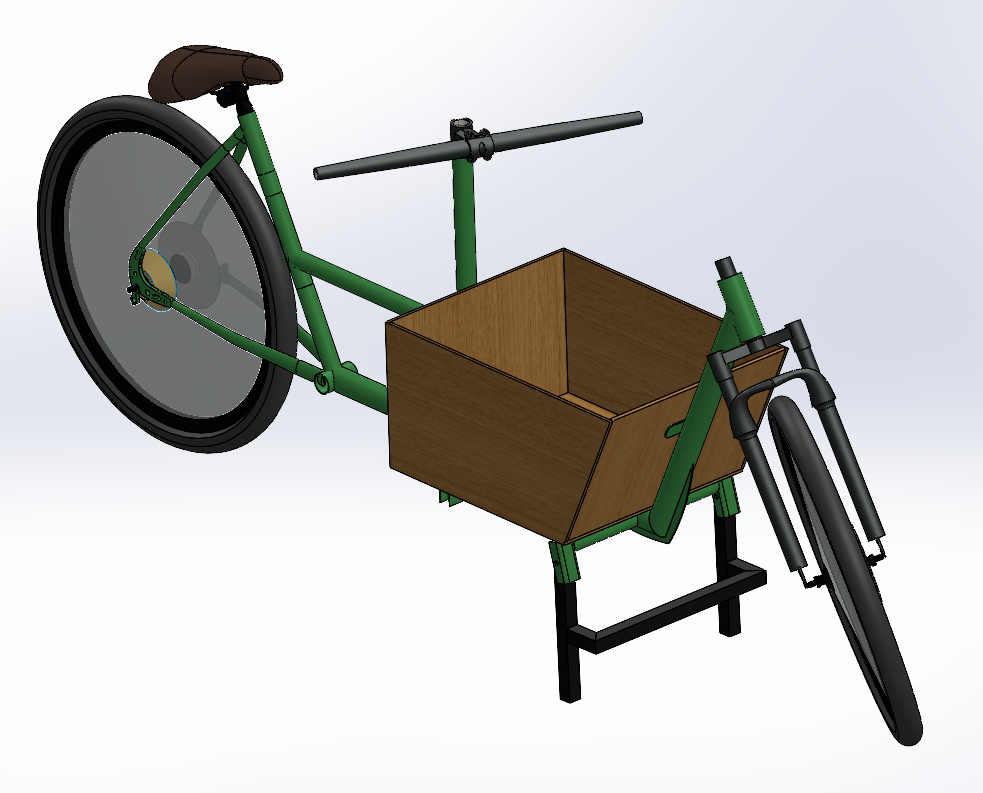
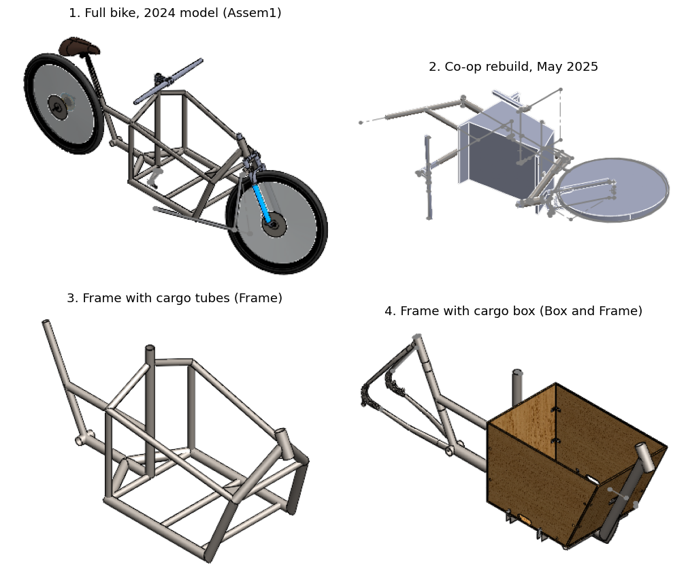
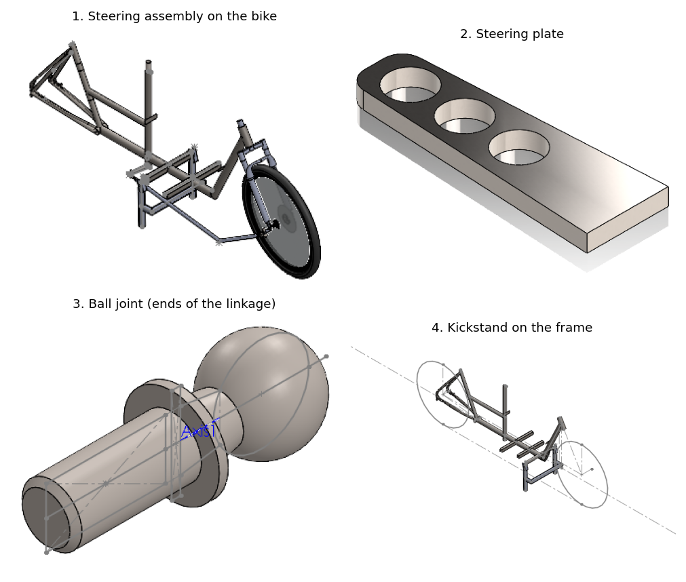
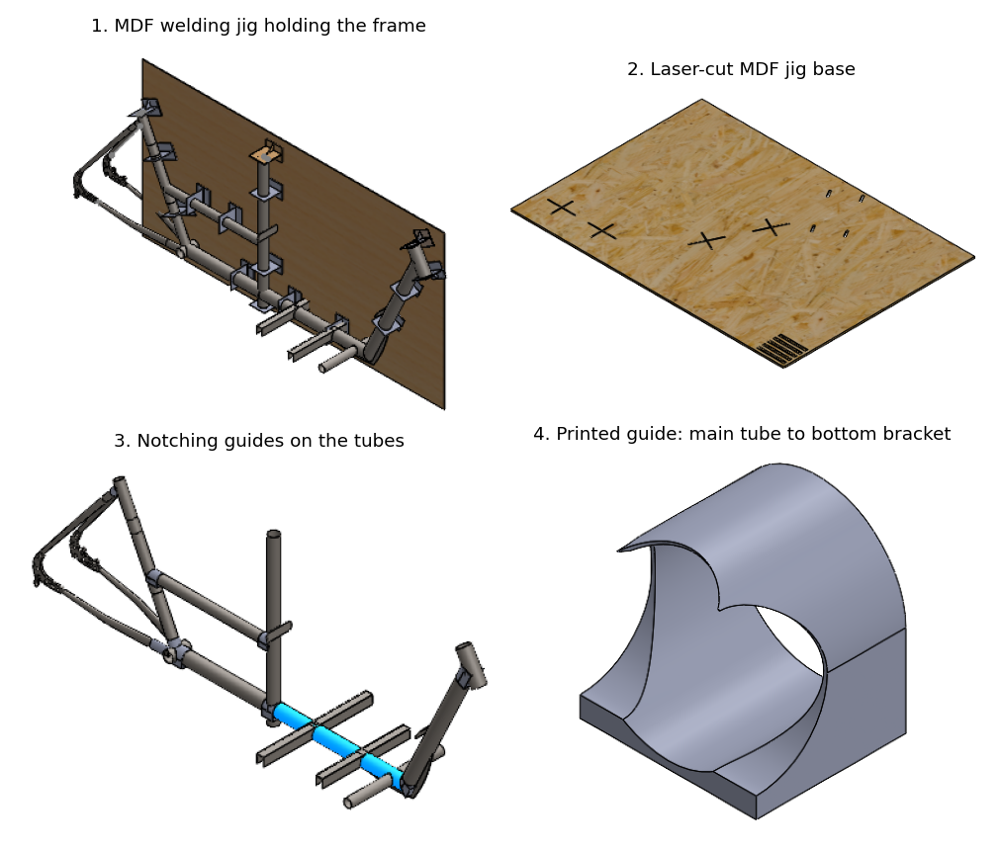
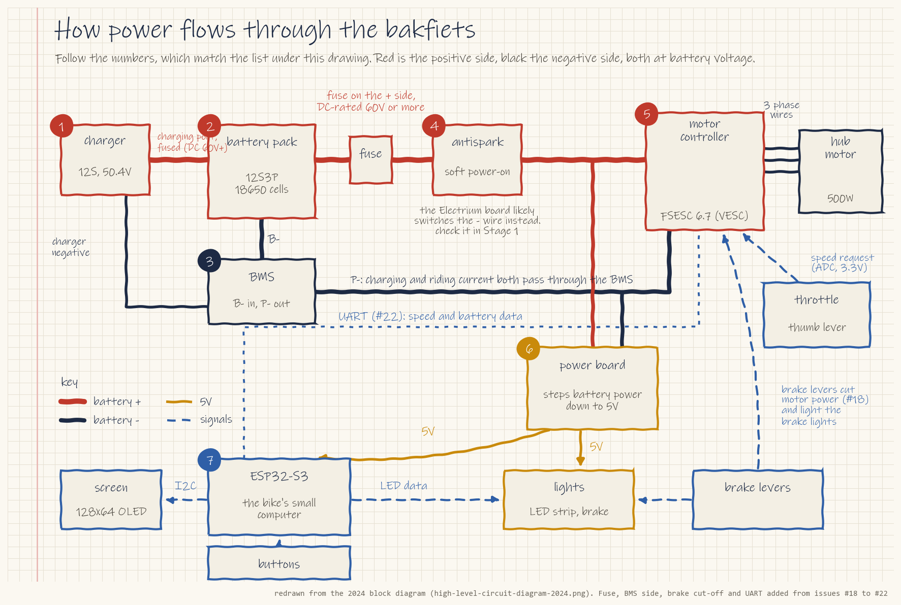
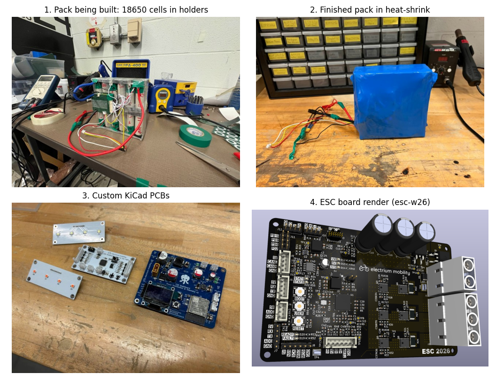
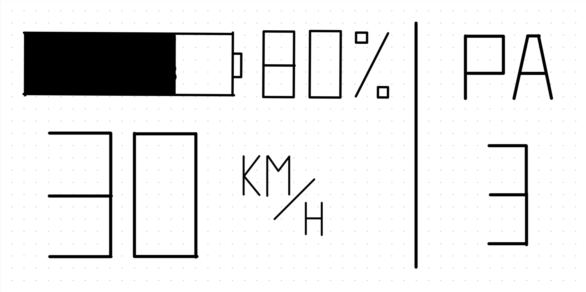

# Bakfiets F26 Onboarding

Last updated 2026-09-26 · Justin Gu, project lead

You will help finish an electric cargo bike. A bakfiets is a Dutch bike with a big box in front of the rider; ours adds a motor, a 48 V battery, lights and a small screen. Electrium started it in Winter 2024 and partly built it. The last work on it was in May 2025.

This page takes you from zero to your first contribution. Work through it from top to bottom. Every file lives in this repo; the [README](README.md) maps the folders.

*The 2024 design, from the club website. The rider sits at the back and the cargo box rides between the rider and the front wheel.*

## Rules

- Finish the safety training before you use any tool or touch a battery. No exceptions.
- Never work on a battery pack alone.
- Work on a branch and open a pull request. Never push straight to `main`.
- Never move or rename files in `mechanical/cad-2024/` or `mechanical/cad-2025-coop/`. Assemblies find their parts by folder path, and moving a file breaks them.
- Post questions in your subteam's Discord thread, not in DMs. That way one answer helps everyone.

## Getting Started

### Prerequisites

You don't need experience. You only need the basics from your first-year courses:

| Subteam | What to refresh |
| --- | --- |
| Mechanical | Making a part and an assembly in SolidWorks |
| Electrical | Ohm's law, and what series and parallel mean |
| Firmware | Basic C or C++: variables, loops, functions |

We are not going to teach you everything here. The linked videos cover what your first stage needs.

### Accounts and Discord

1. Make a free GitHub account at [github.com/signup](https://github.com/signup).
2. Join the Electrium Discord with the [club invite](https://discord.gg/jggFVza4XR).
3. Open the **Bakfiets F26** category. **#bakfiets-general** is the main channel for the whole team. Inside it are four threads: one per subteam (**Bakfiets Mechanical**, **Bakfiets Electrical** and **Bakfiets Firmware**), where subteam questions go, and **Github usernames**.
4. Post your GitHub username in the **Github usernames** thread inside #bakfiets-general. You'll be added to the Electrium-Mobility org, which lets you upload your work.

### Download the Files

**New to Git?** Watch [Git, GitHub and GitHub Desktop for beginners](https://www.youtube.com/watch?v=8Dd7KRpKeaE) (22 min) before you start. The rest of this guide assumes you know what cloning, branches and commits are.

1. Install [GitHub Desktop](https://desktop.github.com/) and sign in.
2. Choose **File > Clone repository > URL**, paste `Electrium-Mobility/Bakfiets-F26`, and leave the local path as it is (`Documents\GitHub\Bakfiets-F26`).
3. Click **Clone** (about 60 MB).
4. Choose **Repository > Show in Explorer**. This folder is **your clone**. Every later step opens files from here, not from the GitHub website.

To get updates later, click **Fetch origin**, then **Pull origin**.

### Software

| Subteam | Install | Notes |
| --- | --- | --- |
| Mechanical | SolidWorks 2026 | Free [student edition](https://www.solidworks.com/product/students) (Windows only), or use the campus labs Fulcrum, Helix, Lever and WEEF, which run 2026 |
| Electrical | [KiCad 9](https://www.kicad.org/download/) | Free. Install with the default libraries |
| Firmware | [Arduino IDE 2](https://www.arduino.cc/en/software) with ESP32 support | Free. Follow [this written guide](https://randomnerdtutorials.com/installing-esp32-arduino-ide-2-0/) to add ESP32 boards |

**⚠️ Warning:** the team uses SolidWorks **2026**. A file saved in 2026 can't be opened in an older version, so don't install an older one.

### Safety Training

You can start setup, CAD and code right away. Finish this before you use tools or touch a battery.

| Training | Needed for | Where |
| --- | --- | --- |
| WHMIS 2015 (course code SO2017), about 1 hour | Everything in the shop or our room. Renew every 5 years | [LEARN](https://learn.uwaterloo.ca/) > Self Registration ([Safety Office page](https://uwaterloo.ca/safety-office/training/student-safety-orientation-whmis)) |
| Engineering Student Machine Shop Orientation | The Engineering Student Shops. You get an access card afterwards | LEARN. Score 100% on each module quiz ([Student Shops page](https://uwaterloo.ca/engineering-student-shops/getting-started)). Shop hours this term: 8:30 am to 4:30 pm, Monday to Friday, plus every second Saturday |
| Welding | The SDC welding room | Welding training is now run by the MME department's new welding lab. Everyone, including previously approved welders, must pass the weld test before using the room; the SDC's Graeme is sending details. No onboarding task needs it |
| Laser cutter | Only that machine | Hands-on, from the shop that runs it. No onboarding task needs it |

**Battery rules** (from the UW [Lithium Cell and Battery Standard](https://uwaterloo.ca/safety-office/laboratory-safety/batteries), plus common practice):

- Wear safety glasses, take off rings and watches, use insulated tools, and tape over bare terminals.
- Charge and store packs in a fire-resistant LiPo bag, away from anything that burns. Never leave a pack charging unattended or sitting on the charger.
- Every pack goes on the SDC's shared battery and chemical inventory sheet, which the SDC is setting up this term.
- Our pack reaches 50.4 V when full. UW's standard calls for electrical-safety procedures at 50 V and above. Use only the matching 12S charger.
- The 2024 pack may be over-discharged after sitting since 2024. Don't charge it until the electrical lead has measured it.
- Never use a swollen or damaged pack. If a pack gets hot, smells or smokes, get everyone away and pull the fire alarm if there's fire. Then tell the electrical lead and the project lead.

**Where the bike is:** **workbay 1002** in the Sedra Student Design Centre (SDC), the Electrium Mobility bay. Entry is by WatCard. To get on the access list, post a screenshot of your WHMIS certificate in the **Github usernames** thread, and the project lead sends your name to the SDC.

**In the SDC:** the four shared rooms use sign-up sheets, so book before you use one and leave it tidy. Put work tables away when it isn't busy. Electrium's safety captain inspects our bay in the first week of each month, so keep it clean.

## The Project

### Where It Stands

| Area | What exists | Next milestone |
| --- | --- | --- |
| Mechanical | A SolidWorks model, a welding jig, notching guides, one FEA study and a partly built frame | Record what is welded; rerun FEA with written load cases |
| Electrical | A power flow diagram. The 2024 schematics were never pushed to GitHub | Confirm the motor; draft the power board schematic |
| Firmware | A screen and LED demo with fixed numbers | Show a real battery voltage and one working button |

### Open Questions

The 2024 files disagree on a few basics. Below is the answer we're working from for each, and how to check it on the real bike. Until a check says otherwise, plan around these answers.

#### 1. Which motor does the bike have?

- **Our answer:** a 500 W hub motor driven by an FSESC 6.7, a VESC-based motor controller made by Flipsky.
- **Why:** the club website names that exact controller. The README and the 2024 CAD point to a Bafang BBS02 mid-drive instead, but they date from February 2024, before the build. The website added its description in June 2024 and repeated it in April 2025.
- **How to check:** look at the bike ([issue #1](https://github.com/Electrium-Mobility/Bakfiets-F26/issues/1)). A hub motor is a thick drum around a wheel's axle, with a cable coming out of the axle. A BBS02 is a box at the pedals that replaces the crank and chainring. Photograph any separate controller box and its label. Ling, Electrium's team lead, is also tracking down the motor that was meant for the bike.
- **If we're wrong:** a BBS02 has its own built-in controller. The electrical plan would drop the separate ESC, and firmware would read the BBS02's display protocol instead of the VESC's.

#### 2. Which microcontroller runs the screen?

- **Our answer:** an ESP32-S3.
- **Why:** the June 2024 website says ESP32-S3, and the display code uses GPIO 9 and 10, which a plain ESP32 can't use because they connect to its flash chip. The November 2024 CAN test code targets a plain ESP32 dev board.
- **How to check:** if the 2024 board is in the room, its chip or silkscreen label will say ESP32-S3.
- **If we're wrong:** the screen and LED pins in the desk demo would need to move to other GPIOs.

#### 3. What happened to the 2024 electrical design?

- **Our answer:** nothing beyond the block diagram was saved, so this term designs the power board and wiring from scratch.
- **Why:** no schematic, PCB or pack file for the bakfiets exists in any Electrium repo. The only electrical file is the block diagram redrawn in Electrical Onboarding.
- **How to check:** photograph any boards, pack or wiring still on the bike ([issue #7](https://github.com/Electrium-Mobility/Bakfiets-F26/issues/7)). Anything found becomes a reference, not a finished design.
- **If we're wrong:** nothing is lost. A found board saves time, but the new design still has to be rated for the 50.4 V pack.

#### 4. How much of the frame is built?

- **Our answer:** partly. Some tubes are welded, and the battery mount and final cargo box don't exist yet.
- **Why:** the latest note, from the May 2025 CAD rebuild, calls the bike "partially built" and models it that way.
- **How to check:** photograph the frame and list which joints are welded ([issue #2](https://github.com/Electrium-Mobility/Bakfiets-F26/issues/2)), then measure it against the CAD ([issue #4](https://github.com/Electrium-Mobility/Bakfiets-F26/issues/4)).
- **If we're wrong:** the mechanical plan shifts between finishing the welds and starting over on parts of the frame. Nothing gets cut or welded until the FEA check ([issue #6](https://github.com/Electrium-Mobility/Bakfiets-F26/issues/6)) is done either way.

### Who Leads What

| Role | Person | What they do |
| --- | --- | --- |
| Project lead | Justin Gu | Priorities, decisions that affect more than one subteam, purchases (through the SDC purchase request process) and room access |
| Mechanical lead | Being chosen in [issue #17](https://github.com/Electrium-Mobility/Bakfiets-F26/issues/17) | Runs the Bakfiets Mechanical thread, keeps mechanical issues current, approves CAD pull requests |
| Electrical lead | Being chosen in [issue #17](https://github.com/Electrium-Mobility/Bakfiets-F26/issues/17) | Same for electrical, and supervises all battery work |
| Firmware lead | Being chosen in [issue #17](https://github.com/Electrium-Mobility/Bakfiets-F26/issues/17) | Same for firmware, and approves code pull requests |

Until the subteam leads are chosen, Justin Gu covers all three roles. The whole team meets **Wednesdays, 6:30 to 7:30 pm, in workbay 1002**. Design reviews and team decisions happen there. Subteam leads also meet the project lead briefly each week to raise blockers. The first team meeting was on 2026-09-23.

**How work flows:** you claim a task by commenting "I'll take this" on its GitHub issue; nobody needs to assign you. You post a short update on your issue each week: what you did, what's next, and anything blocking you. Anyone can review a pull request, and your subteam lead gives the final approval.

## Mechanical Onboarding

You will open the bike in SolidWorks, then make your first contribution to it. Mechanical is the furthest along: the model exists and the frame is partly built. What's missing is a battery mount, a final cargo box and a written strength check.

*(1) The 2024 model of the whole bike. (2) The May 2025 model, which matches the partly built frame. (3, 4) The frame: a normal rear half plus a long, low section that carries the box.*

### Stage 1: Open the Bike

No hardware needed: do all of Stage 1 on your own laptop or a lab PC.

#### Task

Open the newest model of the bike, `bakfiets_main_asm.SLDASM`, with every part loaded.

#### Steps

1. With SolidWorks 2026 installed (see Software), tell SolidWorks where the custom tube shapes are. Choose **Tools > Options > System Options > File Locations**, set **Show folders for** to **Weldment Profiles**, click **Add**, and choose your clone's `mechanical\cad-2025-coop` folder. Click **OK**. This needs no admin rights.
2. Choose **File > Open** and open `mechanical\cad-2025-coop\bakfiets_main_asm.SLDASM` from your clone.

**💡 Hint:** if SolidWorks asks where a part is, point it at the same `cad-2025-coop` folder. The parts are built around one master sketch, `bakfiets_master_sketch.SLDPRT`, so the whole bike follows it. To change the geometry, copy the co-op files into `mechanical/cad-2026/` first and work on the copy. If the frame still shows rebuild errors, copy the `bakfiets_weldment_profiles` folder into the default Weldment Profiles folder listed in that same File Locations dialog (this one needs admin rights).

First time in SolidWorks? Watch [Your First Part](https://www.youtube.com/watch?v=qjtYqxNpj50) (8 min), then [Introduction to Weldments](https://www.youtube.com/watch?v=nbMxA178ADM) (15 min), which shows how tube frames are built.

#### Deliverable

A screenshot of the full assembly open in SolidWorks, posted in the **Bakfiets Mechanical** thread.

### Stage 2: First Contribution

#### Task

Pick one of these issues and claim it by commenting "I'll take this".

| Issue | What you'll do |
| --- | --- |
| [#2](https://github.com/Electrium-Mobility/Bakfiets-F26/issues/2) | Photograph the real frame and record which joints are welded (safety training first; look only) |
| [#3](https://github.com/Electrium-Mobility/Bakfiets-F26/issues/3) | List every part in the co-op model, with its material and whether we own it |
| [#4](https://github.com/Electrium-Mobility/Bakfiets-F26/issues/4) | Measure the real frame against the CAD, with your mechanical lead (safety training first) |
| [#5](https://github.com/Electrium-Mobility/Bakfiets-F26/issues/5) | Sketch two battery mount options for a 12S pack |
| [#6](https://github.com/Electrium-Mobility/Bakfiets-F26/issues/6) | Rerun the frame FEA with the load cases written in the issue ([FEA video](https://www.youtube.com/watch?v=Ys0eT57DzT4)) |

#### Constraints

| Requirement | Value |
| --- | --- |
| Software | SolidWorks 2026 |
| Where new files go | `mechanical/cad-2026/` (create it if it's missing) |
| Frozen folders | Never edit, move or rename anything in `cad-2024` or `cad-2025-coop` |
| Fabrication | Nothing goes out for cutting or welding until #6 is done and the mechanical lead and project lead approve it. Welders must have passed the SDC weld test |

#### Deliverables

A pull request that includes your files, says `Closes #<issue number>`, and has screenshots in its description. Photos and measurement notes can go straight into the issue instead.

### Reference

| What | File in your clone |
| --- | --- |
| Newest whole bike | [`mechanical/cad-2025-coop/bakfiets_main_asm.SLDASM`](mechanical/cad-2025-coop/bakfiets_main_asm.SLDASM) |
| 2024 whole bike | [`mechanical/cad-2024/Assem1.SLDASM`](mechanical/cad-2024/Assem1.SLDASM) |
| 2024 frame | [`mechanical/cad-2024/Frame 2.0.SLDPRT`](mechanical/cad-2024/Frame%202.0.SLDPRT) and its drawing [`Frame 2.0-Sweep8.SLDDRW`](mechanical/cad-2024/Frame%202.0-Sweep8.SLDDRW) |
| Tube sizes | [`mechanical/cad-2024/Weldment Cross-section/`](mechanical/cad-2024/Weldment%20Cross-section) |
| Steering | [`mechanical/cad-2024/steering system/`](mechanical/cad-2024/steering%20system) |
| Welding jig and laser-cut files | [`mechanical/cad-2024/jig/Jig/`](mechanical/cad-2024/jig/Jig) |
| Printable notching guides | [`mechanical/cad-2024/notches/`](mechanical/cad-2024/notches) |
| Every file, explained | [`mechanical/README.md`](mechanical/README.md) |

*How the steering works: the handlebars turn a plate under the frame. A rod with a ball joint at each end (3) pushes a plate on the fork, so the front wheel turns. The kickstand (4) sits under the box.*

*How the 2024 team set up the frame build. A laser-cut wooden jig (1, 2) holds the tubes for welding. 3D-printed guides (3, 4) mark where to cut each tube end.*

Other Electrium teams have solved similar problems: the [longtail cargo frame](https://github.com/Electrium-Mobility/longtail-conversion-kit/tree/main/Mechanical/LongtailFrameV7) has drawings and printable weld angle blocks, and the [vroom battery box](https://github.com/Electrium-Mobility/vroom_mechanical/tree/main/Mechanical/Battery%20Box) shows a BMS mount for issue #5. The full list is in [docs/reference-projects.md](docs/reference-projects.md).

## Electrical Onboarding

You will learn to read a real Electrium board, then help design the bike's electrical system from scratch. The 2024 schematics were never pushed to GitHub, so this term starts fresh.

### Background: How Power Flows

*Thick red lines carry full battery voltage (about 36 to 50 V). Orange lines carry 5 V. Dashed blue lines are signals only.*

1. **Charger** fills the pack to 50.4 V.
2. **BMS** (battery management system) protects the cells from overcharging, over-draining, overheating and shorts.
3. **Battery pack**: 12S3P. That's 12 groups of 3 cells wired in series: 36 cells, about 44 V in normal use. "48 V" is the class name.
4. **Antispark**: the power button switches it on, so the controller's capacitors charge gently instead of sparking.
5. **Motor controller (ESC)** turns battery power into the three motor wires. The throttle sends it a speed request.
6. **Power board (PDB)** steps 48 V down to 5 V for the small electronics and lights.
7. **ESP32-S3** runs the display and LED strip, and reads the buttons.

**⚠️ Warning:** parts that carry the battery voltage need margin above 50.4 V: use MOSFETs and capacitors rated 80 to 100 V. Surge (TVS) diodes are the exception: pick one whose standoff voltage sits just above 50.4 V, about 54 to 58 V, so it clamps spikes before they reach the MOSFETs.

### Stage 1: Read a Real Board

No hardware needed: do all of Stage 1 on your own laptop.

#### Task

Read the 2023 [anti-spark](https://github.com/Electrium-Mobility/anti-spark) schematic and explain how it works. It's a small, real Electrium board: 18 parts, with three 100 V MOSFETs. You need KiCad 9 installed first (see Software).

#### Steps

1. In GitHub Desktop, choose **File > Clone repository > URL** and paste `Electrium-Mobility/anti-spark`.
2. In KiCad, choose **File > Open Project** and pick `Anti-Spark Switch.kicad_pro` in your `anti-spark` folder.
3. KiCad says the project is from an older version and offers to upgrade it. Click OK. Don't commit the upgraded files.
4. In the left panel, double-click `Anti-Spark Switch.kicad_sch`.
5. Find the three MOSFETs and trace where the battery connects.

**💡 Hint:** if you open the PCB, KiCad warns that the `XT60PW-F` footprint library is missing. The 2023 designer kept it on their own computer. It doesn't affect the schematic.

Videos: [KiCad 9 Getting Started](https://www.youtube.com/watch?v=0WCi1rhueH4) (DigiKey series), [MOSFET as a switch](https://www.youtube.com/watch?v=o4_NeqlJgOs) (6 min), [what a BMS does](https://www.youtube.com/watch?v=rT-1gvkFj60) (13 min).

#### Deliverable

A comment on [issue #8](https://github.com/Electrium-Mobility/Bakfiets-F26/issues/8) that explains, in your own words, what each MOSFET does and what happens when the battery is plugged in.

### Stage 2: First Contribution

#### Task

Pick one of these issues and claim it.

| Issue | What you'll do |
| --- | --- |
| [#1](https://github.com/Electrium-Mobility/Bakfiets-F26/issues/1) | Photograph the motor and controller on the bike to settle which motor we have (safety training first; look only) |
| [#7](https://github.com/Electrium-Mobility/Bakfiets-F26/issues/7) | Photograph the labels on the pack, BMS and charger (safety training first; look only) |
| [#10](https://github.com/Electrium-Mobility/Bakfiets-F26/issues/10) | Redraw the block diagram with real connectors and wire sizes |
| [#11](https://github.com/Electrium-Mobility/Bakfiets-F26/issues/11) | Start the parts list (BOM) |
| [#9](https://github.com/Electrium-Mobility/Bakfiets-F26/issues/9) | List what the 2026 power board needs changed for our pack. Do Stage 1 first |

#### Constraints

| Requirement | Value |
| --- | --- |
| Software | KiCad 9, or [draw.io](https://app.diagrams.net/) for diagrams |
| Voltage rating | MOSFETs and capacitors on the battery side rated 80 to 100 V; TVS diode standoff about 54 to 58 V |
| Where new files go | `electrical/` in the Bakfiets-F26 repo |
| Battery work | Only with the electrical lead present, after all safety training |

#### Deliverables

A pull request with your files, or photos and notes posted in the issue. Say `Closes #<issue number>` in the pull request.

### Reference

| Resource | What you'll learn |
| --- | --- |
| [`electrical/README.md`](electrical/README.md) | Everything known about the bike's electrical system |
| [anti-spark](https://github.com/Electrium-Mobility/anti-spark) | Your Stage 1 board |
| [power-distribution-antispark](https://github.com/Electrium-Mobility/power-distribution-antispark) | A 2026 Electrium 48 V power board with an antispark. Its 60 V MOSFETs and SMCJ48CA surge diode are rated too low for a 50.4 V pack, so treat it as a design reference |
| [esc-w26](https://github.com/Electrium-Mobility/esc-w26) | A well-documented board with input protection explained |
| [F25 Skateboard write-up](https://github.com/Electrium-Mobility/electrium-w24website/blob/main/docs/F2025-projects/F25%20Skateboard.md) | A finished Electrium project with a 12S pack, BMS and power board |

More videos: [soldering](https://www.youtube.com/watch?v=QKbJxytERvg) (5 min), [multimeter](https://www.youtube.com/watch?v=SLkPtmnglOI) (11 min), [buck converter](https://www.youtube.com/watch?v=m8rK9gU30v4) (6 min), [VESC Tool setup](https://www.youtube.com/watch?v=YFl3VvZTRb0) (23 min).

*Finished electrical work on this team: a pack being built, the finished pack and custom PCBs from the F25 skateboard, plus the esc-w26 board.*

## Firmware Onboarding

You will get the 2024 display code running on your desk, then start connecting it to real data. Right now the screen shows fixed numbers. By the end of the term it should show the real speed and battery level from the motor controller.

*The screen layout the 2024 team drew: battery top left, speed bottom left, pedal-assist (PA) level on the right.*

### Stage 1: Run the Desk Demo

**This stage is split in two.** Steps 1, 3 and 4 need no hardware: do them on your own laptop **before Wednesday's meeting**, then click **Verify** (the checkmark button, top left) to check the code builds without a board plugged in. Do steps 2, 5 and 6 once you have a board and screen. How to get a board and screen will be posted in the **Bakfiets Firmware** thread.

#### Task

Run [`firmware/desk-demo/desk-demo.ino`](firmware/desk-demo/desk-demo.ino) on an ESP32-S3 with a screen attached.

#### Materials

| Part | Notes |
| --- | --- |
| ESP32-S3 dev board, such as the ESP32-S3-DevKitC-1 | It must be an S3. A plain ESP32 wires GPIO 9 and 10 to its flash chip |
| SSD1306 128x64 I2C OLED (the common 0.96-inch screen) | How to get a board and screen will be posted in the **Bakfiets Firmware** thread. |
| 4 female-to-female jumper wires, and a USB-C data cable | No LED strip is needed |
| For Stage 2: a push button, a breadboard and a few resistors | Needed for #14 and #15. #15 also uses a bench power supply |

#### Steps

1. With Arduino IDE and ESP32 support installed (see Software), choose **Tools > Manage Libraries** and install **Adafruit SSD1306** and **FastLED**. Click **Install all** when asked; that adds Adafruit GFX and BusIO too.
2. Wire the screen: VCC to 3.3 V, GND to GND, SDA to GPIO 10, SCL to GPIO 9.
3. Choose **File > Open** and pick `firmware\desk-demo\desk-demo.ino` in your clone.
4. Choose **Tools > Board > esp32 > ESP32S3 Dev Module**, and set **Tools > USB CDC On Boot** to **Enabled**.
5. Plug in using the board's USB-C port labelled **USB** (not UART). Pick its COM port under **Tools > Port**.
6. Click **Upload**. After about 10 seconds the screen shows 50%, 36 km/h and PA 5. It stays blank at first because the code plays the LED animation before it draws.

**💡 Hint:** upload says "Failed to connect"? Hold **BOOT**, tap **RST**, release BOOT, and upload again. No COM port? Try another cable, since some only charge; if you're on the port labelled UART instead, install the CP210x or CH340 USB driver. Blank screen? Check SDA and SCL, then set `SCREEN_ADDRESS` to `0x3D`.

Video: [ESP32 OLED tutorial for beginners](https://www.youtube.com/watch?v=u8g34BS8Ouw) (17 min).

#### Deliverable

A photo of the screen showing 50%, 36 km/h and PA 5, posted on [issue #12](https://github.com/Electrium-Mobility/Bakfiets-F26/issues/12).

### Stage 2: First Contribution

#### Task

Pick one of these issues and claim it.

| Issue | What you'll do |
| --- | --- |
| [#13](https://github.com/Electrium-Mobility/Bakfiets-F26/issues/13) | Stop the LED animation from freezing the code, using `millis()` ([video](https://www.youtube.com/watch?v=BYKQ9rk0FEQ), 14 min) |
| [#14](https://github.com/Electrium-Mobility/Bakfiets-F26/issues/14) | Add a button that changes the PA level |
| [#15](https://github.com/Electrium-Mobility/Bakfiets-F26/issues/15) | Show a real battery voltage, read through a voltage divider |
| [#16](https://github.com/Electrium-Mobility/Bakfiets-F26/issues/16) | Decide between one ESP32 and two boards linked by CAN bus |

#### Constraints

| Requirement | Value |
| --- | --- |
| Board | ESP32-S3 |
| Screen pins | SDA GPIO 10, SCL GPIO 9. Keep LEDs off GPIO 9 |
| Loop timing | No `delay()` longer than 20 ms in `loop()` |
| Where new code goes | A new folder, such as `firmware/display-2026/`. Leave `display-2024/` unchanged |
| Battery input | Test with a bench power supply, not the pack, until the electrical lead checks your divider |

#### Deliverables

A pull request with your sketch, a photo or short video of it working, and `Closes #<issue number>`.

### Reference

| What | File or repo |
| --- | --- |
| Original 2024 code | [`firmware/display-2024/main.cpp`](firmware/display-2024/main.cpp) |
| Known bugs in it | [`firmware/README.md`](firmware/README.md) |
| CAN bus test code (Nov 2024) | [`firmware/can-twai-2024/`](firmware/can-twai-2024) |
| VESC data on an OLED | [VESC6\_LCD\_EBIKE.ino](https://github.com/Electrium-Mobility/firmware-workshop/blob/main/VESC6_LCD_EBIKE/VESC6_LCD_EBIKE.ino) in firmware-workshop |
| A minimal VESC dashboard | [F25 bike](https://github.com/Electrium-Mobility/F25-Bike-Repository/tree/main/src/VescUartComunication). Its battery % assumes a smaller pack; ours runs about 36 to 50.4 V |
| VESC over CAN | [Longtail VescCAN driver](https://github.com/Electrium-Mobility/longtail-conversion-kit/tree/main/Bike-Computer/Firmware/components/VescCAN) |
| Debounced buttons | [capyware-firmware](https://github.com/Electrium-Mobility/capyware-firmware) |

**⚠️ Warning:** the longtail app file `Bike-Computer/Firmware/src/vesc_comm.c` sends 5 A to the motor for 1 second at startup (lines 46 to 48), which would likely spin it. Delete those lines before you test that code on a real motor.

## Final Checklist

- [ ] GitHub account made, and username posted in the **Github usernames** thread
- [ ] Bakfiets-F26 cloned with GitHub Desktop
- [ ] Your subteam's software installed
- [ ] WHMIS 2015 (SO2017) done on LEARN, before any work in the room
- [ ] Stage 1 deliverable posted
- [ ] One Stage 2 issue finished (its pull request merged, or its photos and notes posted)

## How to Submit

1. In GitHub Desktop, click **Current branch > New branch** and name it after your task, for example `battery-mount-sketch`.
2. Add your files in the right folder (see your Stage 2 constraints).
3. Type a one-line summary in the **Summary** box at the bottom left (GitHub Desktop won't commit without one), click **Commit to your-branch**, then **Publish branch**, then **Create Pull Request**.
4. In the pull request, say what you did, add screenshots, and write `Closes #<issue number>`.
5. Post the link in your subteam thread. Your subteam lead approves it.

**💡 Hint:** if GitHub Desktop says you don't have permission to push and offers to **create a fork**, click **Fork this repository**, then choose **To contribute to the parent project**. A fork is your own copy of the repo on GitHub. Your pull request still goes to Bakfiets-F26 as normal. This only happens until you've been added to the Electrium-Mobility org, which gives write access automatically.

GitHub's [Hello World guide](https://docs.github.com/en/get-started/start-your-journey/hello-world) walks through branches and pull requests.

## After Onboarding: Term Projects

Once you've finished your subteam's Stage 1 and one Stage 2 starter task, you're done onboarding. Move on to the main goals for the term, set by Electrium's team lead, Ling.

Each project is a GitHub issue labelled `term project`. The issue says what to finish first, gives step-by-step instructions, safety notes, videos and example code, and ends with a clear "done when". Claim one the same way: comment "I'll take this". Work through them roughly in the order below.

### Electrical

| Order | Project | Start after |
| --- | --- | --- |
| 1 | [#21 Battery pack: find out what exists, then decide build or buy](https://github.com/Electrium-Mobility/Bakfiets-F26/issues/21) | #7 |
| 2 | [#18 Bench test: battery, motor controller, motor and thumb throttle](https://github.com/Electrium-Mobility/Bakfiets-F26/issues/18) | #1 and #7 |
| 3 | [#19 Choose a BMS and charging port](https://github.com/Electrium-Mobility/Bakfiets-F26/issues/19) | #7 |
| 4 | [#20 Plan and build the wiring harness](https://github.com/Electrium-Mobility/Bakfiets-F26/issues/20) | #10 to plan; #18 and #19 before building |

### Firmware

| Order | Project | Start after |
| --- | --- | --- |
| 1 | [#23 Decide: screen or no screen, and which one](https://github.com/Electrium-Mobility/Bakfiets-F26/issues/23) | Onboarding |
| 2 | [#22 Connect the ESP32-S3 to the VESC and show real speed and battery](https://github.com/Electrium-Mobility/Bakfiets-F26/issues/22) | #12; testing needs the bench setup from #18 |
| 3 | [#24 Build the 2026 display on top of the 2024 work](https://github.com/Electrium-Mobility/Bakfiets-F26/issues/24) | #23 and #12 |

### Mechanical

| Order | Project | Start after |
| --- | --- | --- |
| 1 | [#25 Design a new steering mechanism (rod, cable or hydraulic)](https://github.com/Electrium-Mobility/Bakfiets-F26/issues/25) | Onboarding |
| 2 | [#26 Mount everything on the frame](https://github.com/Electrium-Mobility/Bakfiets-F26/issues/26) | #3 and #25; part sizes come from #19 and #21 |
| 3 | [#27 Inspect and fix the cargo box](https://github.com/Electrium-Mobility/Bakfiets-F26/issues/27) | Onboarding |
| 4 | [#28 Find and buy missing bike parts](https://github.com/Electrium-Mobility/Bakfiets-F26/issues/28) | #2 and #3 |
| 5 | [#29 Repaint the frame](https://github.com/Electrium-Mobility/Bakfiets-F26/issues/29) | Last: after all welding is done and #6 is approved |

Ling is tracking down the motor that was meant to go on the bike. Updates go in [issue #1](https://github.com/Electrium-Mobility/Bakfiets-F26/issues/1). The same list is in the repo at [docs/term-projects.md](docs/term-projects.md).

## Glossary

### General

| Term | Meaning | Learn more |
| --- | --- | --- |
| Electrium Mobility | The UW student design team that runs this project |  |
| Repo (repository) | An online folder of a project's files and their full change history |  |
| Clone / push | Clone copies a repo to your computer; push sends your changes back to GitHub | [GitHub Desktop guide](https://docs.github.com/en/desktop/adding-and-cloning-repositories/cloning-a-repository-from-github-to-github-desktop) |
| Commit | One saved set of changes |  |
| Branch / pull request | A separate copy of the files you work on, and a request to merge it back after review | [GitHub Hello World](https://docs.github.com/en/get-started/start-your-journey/hello-world) |
| Main | The official branch of a repo |  |
| Issue | A task card on GitHub. `good first issue` marks the easiest starter tasks; `term project` marks the main work after onboarding |  |
| Fork | A copy of a repo under your own GitHub account; GitHub Desktop offers one if you can't push yet. (A bike fork is the part that holds the front wheel.) |  |
| Fetch / pull | Fetch checks GitHub for new changes; pull downloads them into your clone |  |
| Discord channel / thread | A channel is a chat room, like #bakfiets-general; a thread is a side conversation inside a channel (one per subteam here, plus Github usernames) |  |
| LEARN | UW's online course site, where the safety courses are |  |
| WHMIS | Workplace Hazardous Materials Information System, the chemical safety course |  |
| SDC | The Sedra Student Design Centre, the building with the team work bays |  |
| CAD | Computer-aided design: 3D models and drawings of parts |  |
| BOM | Bill of materials: every part, with quantity and where to buy it |  |
| Datasheet | The maker's document with a part's ratings and limits |  |
| Design review | A short meeting where the subteam looks at a design and suggests changes before anything is built or bought |  |
| Term codes | F26 = Fall 2026, W2024 = Winter 2024 |  |

### Mechanical

| Term | Meaning | Learn more |
| --- | --- | --- |
| Bakfiets | A Dutch "box bike" with the cargo box in front of the rider | [Wikipedia](https://en.wikipedia.org/wiki/Bakfiets) |
| 4130 chromoly | The steel alloy our frame uses. It's strong for its weight and weldable | [41xx steel](https://en.wikipedia.org/wiki/41xx_steel) |
| Weldment | A SolidWorks feature that builds a frame from a 3D sketch plus tube sizes | [Javelin walkthrough](https://www.javelin-tech.com/blog/2024/05/solidworks-weldments/) |
| Weldment profile | The cross-section shape of a tube, stored as a file SolidWorks can reuse |  |
| Master sketch | One sketch of key points and lines that every part follows |  |
| Jig | A fixture that holds tubes at the right angles for welding | [Framebuilder Supply](https://framebuildersupply.com/pages/what-do-i-need-to-build-my-first-frame) |
| Notching | Cutting a tube end into a curved saddle so it sits flush against another tube | [Tube notching](https://en.wikipedia.org/wiki/Tube_notching) |
| Tube size | Outside diameter x wall thickness, for example 1.5" x 0.065" |  |
| Rear triangle | The seat stays and chain stays that hold the back wheel |  |
| MDF | A cheap fibreboard that cuts cleanly on a laser cutter |  |
| SLDPRT / SLDASM / SLDDRW | SolidWorks part, assembly and drawing files |  |
| DXF / STL | A 2D drawing for laser cutting / a 3D shape for printing |  |
| FEA | A simulation of how much a part bends and how stressed it gets under load | [Finite element method](https://en.wikipedia.org/wiki/Finite_element_method) |
| Load case / safety factor | A set of forces to test against / how many times stronger a part is than it needs to be |  |
| Hub motor / mid-drive | A motor inside a wheel / a motor that turns the pedal cranks | [Electric bicycle](https://en.wikipedia.org/wiki/Electric_bicycle) |

### Electrical

| Term | Meaning | Learn more |
| --- | --- | --- |
| 18650 cell | The standard cylindrical lithium-ion cell in our pack | [18650 battery](https://en.wikipedia.org/wiki/18650_battery) |
| 12S3P | 12 groups in series, 3 cells per group. About 44 V nominal, 50.4 V full, 36 V empty | [Battery University](https://batteryuniversity.com/article/bu-302-series-and-parallel-battery-configurations) |
| BMS | Battery management system. It balances cells and cuts power on overcharge, over-drain, overheating or a short | [Wikipedia](https://en.wikipedia.org/wiki/Battery_management_system) |
| Antispark / precharge | A circuit that stops the spark when a battery first connects to a motor controller | [Pre-charge](https://en.wikipedia.org/wiki/Pre-charge) |
| ESC / VESC / FSESC 6.7 | The motor controller. VESC is an open-source design; the FSESC 6.7 is the VESC-based model the club website says the 2024 team used | [VESC project](https://vesc-project.com/) |
| PDB | Power distribution board: splits battery power and steps 48 V down to 5 V |  |
| Buck converter | A circuit that steps voltage down efficiently | [Wikipedia](https://en.wikipedia.org/wiki/Buck_converter) |
| MOSFET | An electronic switch that a small signal can turn on | [MOSFET switch](https://projecthub.arduino.cc/ejshea/connecting-an-n-channel-mosfet-6a7325) |
| TVS diode | A surge protector. Its standoff voltage (the highest voltage it ignores) must sit just above 50.4 V; its clamp voltage (the most it lets through) must stay below what the other parts survive |  |
| Bench power supply | A lab box that gives an adjustable voltage with a current limit, used for safe testing instead of a battery |  |
| XT60 / JST | A common battery plug / a family of small signal connectors | [XT60](https://components101.com/connectors/xt60-connector) |
| LiPo bag | A fire-resistant bag for charging and storing batteries |  |
| Schematic / PCB | A drawing of a circuit / the printed circuit board it's built on | [KiCad getting started](https://docs.kicad.org/9.0/en/getting_started_in_kicad/getting_started_in_kicad.html) |
| Gerbers | The files a factory uses to make a PCB |  |
| Voltage divider | Two resistors that scale 50 V down to a level the ESP32 can measure | [SparkFun](https://learn.sparkfun.com/tutorials/voltage-dividers/all) |

### Firmware

| Term | Meaning | Learn more |
| --- | --- | --- |
| ESP32-S3 | The small computer (microcontroller) that runs our screen and lights | [ESP32](https://en.wikipedia.org/wiki/ESP32) |
| Dev board | A microcontroller on a board with USB, ready for testing |  |
| GPIO | One pin the code can read or switch | [GPIO](https://en.wikipedia.org/wiki/General-purpose_input/output) |
| VCC / GND / SDA / SCL | Power / ground / I2C data / I2C clock pins |  |
| I2C | The two-wire link to the screen | [SparkFun I2C](https://learn.sparkfun.com/tutorials/i2c/all) |
| UART | A simple serial link many motor controllers use | [SparkFun serial](https://learn.sparkfun.com/tutorials/serial-communication/all) |
| CAN / TWAI | A reliable two-wire link between boards. Espressif calls its CAN driver TWAI | [CAN bus](https://en.wikipedia.org/wiki/CAN_bus) |
| COM port / USB CDC | How Windows sees the board over USB / the setting that makes Serial Monitor work on the S3's USB port |  |
| SSD1306 | The 128x64 OLED screen | [Random Nerd Tutorials](https://randomnerdtutorials.com/esp32-ssd1306-oled-display-arduino-ide/) |
| WS2813 / FastLED | An LED strip where each LED is set on its own / the library that drives it | [Random Nerd Tutorials](https://randomnerdtutorials.com/guide-for-ws2812b-addressable-rgb-led-strip-with-arduino/) |
| millis() / non-blocking | Arduino's clock / code that keeps running instead of pausing | [Blink Without Delay](https://docs.arduino.cc/built-in-examples/digital/BlinkWithoutDelay/) |
| ADC pin | A pin that measures a voltage |  |
| Breadboard | A plastic board with holes for building test circuits without soldering |  |
| Debounce | Ignoring the brief flicker when a button is pressed, so one press counts once |  |
| Silkscreen | The printed labels on a circuit board, such as pin names |  |

## Sources

- [Bakfiets-F26](https://github.com/Electrium-Mobility/Bakfiets-F26): this term's repo. [`docs/history/SOURCES.md`](docs/history/SOURCES.md) records where every file came from and the 2024 team roster
- [bakfiets](https://github.com/Electrium-Mobility/bakfiets): the original 2024 repo, kept unchanged as the archive
- Club website pages for [W2024](https://github.com/Electrium-Mobility/electrium-w24website/blob/main/docs/W2024-projects/project1_2023.md) and [W2025](https://github.com/Electrium-Mobility/electrium-w24website/blob/main/docs/W2025-projects/bakfiets_2024.md)
- UW: [SDC Forms and Team Information](https://uwaterloo.ca/sedra-student-design-centre/forms-and-team-information) (SDC forms for purchases, expenses and room booking; UW login needed), [WHMIS](https://uwaterloo.ca/safety-office/training/student-safety-orientation-whmis), [student shops](https://uwaterloo.ca/engineering-student-shops/getting-started), [lithium battery standard](https://uwaterloo.ca/safety-office/laboratory-safety/batteries), [lab software](https://uwaterloo.ca/engineering-computing/computer-labs/lab-software)

This guide draws on all 82 repos in the Electrium-Mobility org, searched on 2026-09-25. Every video link was checked against YouTube.

This guide is new this term. If a step didn't work for you, fix it in a pull request or post what went wrong in #bakfiets-general, and the next person won't hit it. Welcome to the team.
