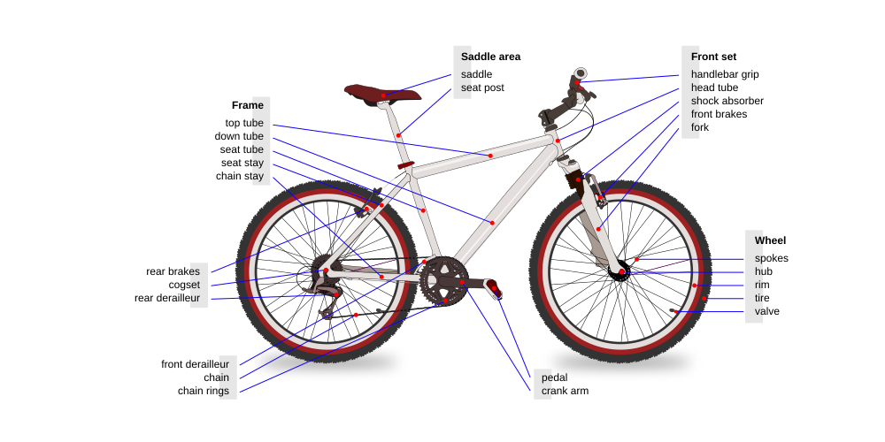
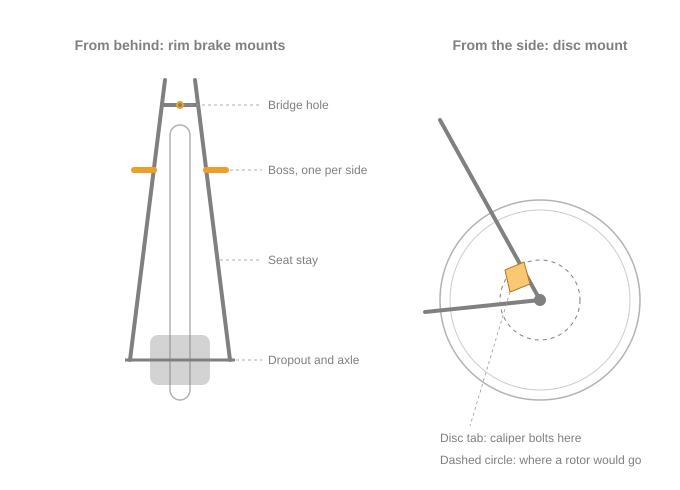
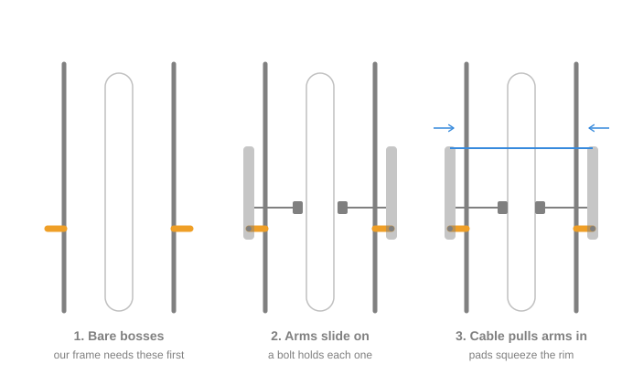

# Brakes: what we know so far

Background for [#32](https://github.com/Electrium-Mobility/Bakfiets-F26/issues/32) (claimed by Sonya and Olivia, due Wed 21 Oct). Written 10 Oct 2026. This page collects what we've found on the bike, with a labelled photo for each finding, plus some reference on how brakes mount. It doesn't pick a solution, since that's what #32 is for.

## What the brakes have to do

Ontario's e-bike rules ask for two independent braking systems that apply force to each wheel, able to stop the bike from 30 km/h within 9 m on level asphalt ([ontario.ca](https://www.ontario.ca/page/riding-e-bike)). The same rules cap e-bike motors at 500 W, which is why our motor is limited to 500 W in VESC.

Pulling a brake lever also has to cut the motor (O. Reg. 369/09 s. 3(2)). On our bike that's a switch wired to the controller's ADC2 input ([#18](https://github.com/Electrium-Mobility/Bakfiets-F26/issues/18), step 7).

## What we've found

### The front brake line has to get from the middle of the bike to the front

The handlebars sit in the middle of the frame, and the head tube (where the fork goes) is at the far front, past the box. The fork isn't fitted yet. Whatever connects the front brake lever to the front wheel has to cover that distance and still work when the steering turns.

Nobody has decided how it gets there. It could cross over the box (yellow) or follow the frame tubes under it (blue), and the steering design ([#25](https://github.com/Electrium-Mobility/Bakfiets-F26/issues/25)) will change it either way. The length depends on the route, so it hasn't been measured.

The front wheel already has a hydraulic disc brake, and its hose is far too short for any of these routes. That's from looking at it in the bay. There's no close photo of it yet, so its brand, model and fluid type are still unknown.

### The motor goes on the back and has no rotor mount

The threads next to the axle are where a freewheel (the rear gears) screws on. Gears and the chain drive the rear wheel, so this is a rear motor. The side covers are held on by small screws.

There's no visible ring of bolt holes for a disc rotor around the axle, so a disc brake can't bolt onto the back wheel as it is. A close-up of both sides would confirm this.

The rim has a silver band along its edge. That usually means a machined surface for rim brakes, but nobody has checked it up close yet.

### The seat stays have no bosses

V-brakes and cantilever brakes mount on bosses (see below). Our seat stays look like smooth tube with only tape on them. There's also no bridge between them, which is where an old style caliper brake would bolt through. The photo is low resolution, so this is worth checking by hand.

The dropout plates have several holes. Some could be rack eyelets, and the raised ones on the far plate might be a disc tab. Measuring the hole spacing would tell (51 mm apart for an IS disc mount, 74 mm for a post mount). If it is a disc tab, the back wheel's options change.

### Where things stand

| | Front wheel | Back wheel |
| --- | --- | --- |
| Brake now | Hydraulic disc | None |
| Problem | Hose far too short | No rotor mount on the motor, no bosses on the frame |
| Unknown | Brand, model, fluid type, hose fittings, pads, route | Whether the rim band is a brake track, what the dropout holes are |

## Questions to work out

- What is the front brake we have, and what would it take to make it reach the handlebars? Which other parts have to match it? Is reusing it simpler than replacing it?
- Should the front line go over the box or along the frame, and how does the steering design affect that?
- With no rotor mount and no bosses, how could the rear wheel be braked? What does each way cost, and does it change the frame?
- What kind of cut-off switch fits the levers we end up with, and how does it connect to the controller?
- How much load should the brakes be sized for, with a rider, cargo, the battery and the bike itself?

Some approaches people use for a rear hub motor with no disc mount: bosses brazed or welded onto the seat stays, clamp-on boss plates (forum users are wary of them), an adapter that bolts a rotor to the motor's cover, a disc tab if the frame has one, or a different motor with a disc mount. Drum and coaster brakes need their own hub, so they can't work with a hub motor.

Some limits that apply:
- Steering and brakes share roughly $220 to $260 of the term's budget.
- Changing the frame (welding, drilling, filing) needs approval from a mechanical lead and the project lead.
- Parts go through the project lead once #32 has the specs they need to match.
- Mineral oil and DOT brake fluid can't be mixed. The wrong one ruins the seals.
- The brakes get a stopping test before anyone rides the bike.

Regen braking (the motor slowing the wheel) stops working if the controller or battery cuts out, and it fades away at low speed, so it can't hold the bike still.

## Reference

### Words used here

- **Caliper:** the part that squeezes. On a disc brake it grips the rotor.
- **Rotor:** the metal disc bolted to a wheel's hub that a disc caliper grips.
- **Hydraulic:** the lever pushes fluid through a hose to the caliper. Cable brakes use a steel cable instead.
- **Dropouts:** the slotted plates at the back where the rear axle sits.
- **Freewheel:** the rear gears, which screw onto the hub.
- **Torque arm:** a bracket that stops a hub motor's axle from spinning in the dropouts ([#31](https://github.com/Electrium-Mobility/Bakfiets-F26/issues/31)).
- **Regen:** using the motor as a generator to slow the wheel.

### Parts of a bike

A regular bike, not a cargo bike, but the back half is built the same way as ours. Seat stays run from under the seat down to the rear axle. Chain stays run forward from the rear axle to the pedals.

### What a boss is

A boss is a short metal post fixed to the frame, with a threaded hole in the end. V-brakes and cantilevers need two, one on each seat stay just above the rim. The brake arms slide over them and a bolt holds each arm on.

Two bare bosses on another bike, before a brake is fitted. Our seat stays, shown above, have nothing like this.

A V-brake mounted on bosses. Each arm pivots on a boss hidden under the bolt at its bottom end.

### Where brake mounts sit

Bosses (dark orange posts) hold rim brakes. A disc tab (light orange plate) holds a disc caliper, which also needs a rotor on the wheel. A bridge hole holds an old style caliper brake.

### How a rim brake works on bosses

Seen from behind the rear wheel. The arms (light grey) pivot on the bosses (orange). The cable (blue) pulls the arm tops together, and the pads (solid grey) squeeze the rim.

### How the hub motor works

The stator (copper coils) is fixed to the axle, and the axle is bolted to the frame, so it never turns. The shell has magnets glued inside it and spins around the stator, and the spokes connect the shell to the rim. The controller sends current through the three phase wires in a rotating pattern, so the coils' magnetic field turns and drags the magnets along with it. Hall sensors on the stator tell the controller where the magnets are.

The stator pushes back on the axle as hard as it pushes the wheel, which is why the axle needs torque arms (#31).

Some facts to weigh if anyone thinks about braking on the motor shell itself: nothing on the frame sits beside the shell to hold a brake, the covers are thin plates on small screws, the spoke flanges stick out around the edge, and braking makes heat right next to the motor's magnets, which weaken when they get too hot.

## Image credits

- Bike diagram: [Al2, Wikimedia Commons](https://commons.wikimedia.org/wiki/File:Bicycle_diagram-en.svg), CC BY 3.0. White background and viewBox added.
- V-brake photo: [Keithonearth, from a photo by ArnoldReinhold, Wikimedia Commons](https://commons.wikimedia.org/wiki/File:Linear_pull_bicycle_brake_highlighted.jpg), CC BY-SA 3.0. Resized and labelled.
- Bare bosses photo: [Bicycles Stack Exchange](https://bicycles.stackexchange.com/questions/87966/aside-from-brakes-what-items-can-be-mounted-to-v-brake-mounts), CC BY-SA. Resized and labelled.
- Frame and motor photos, labels and the three diagrams: Bakfiets F26.
