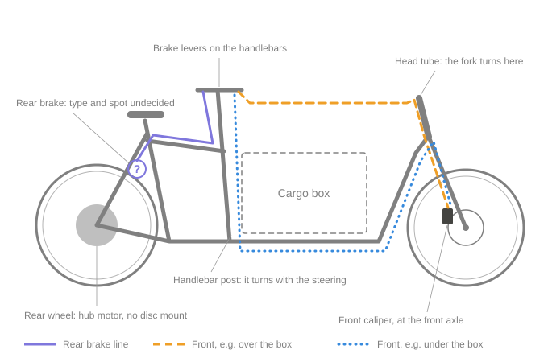
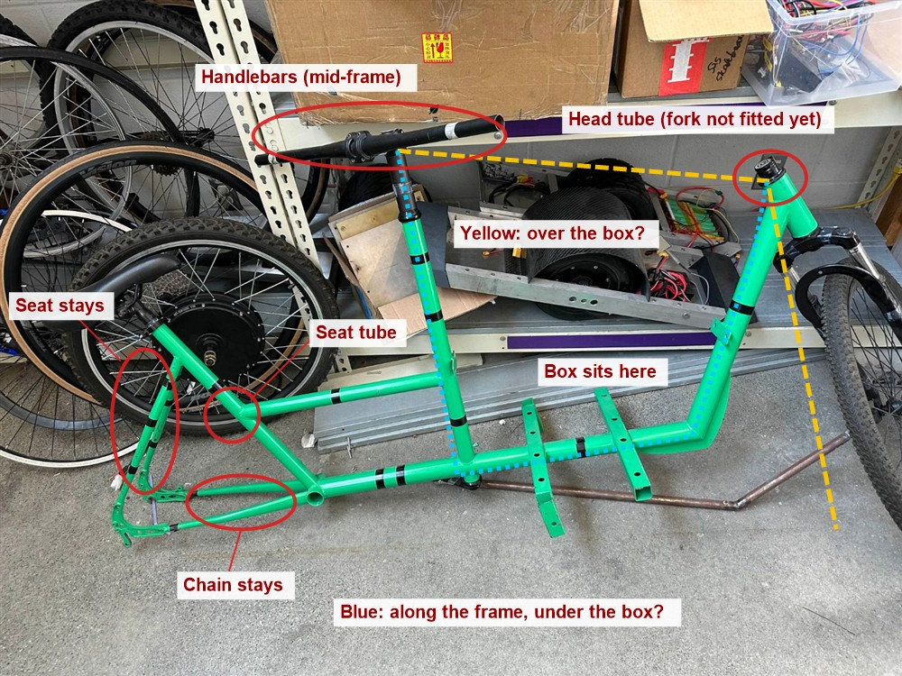
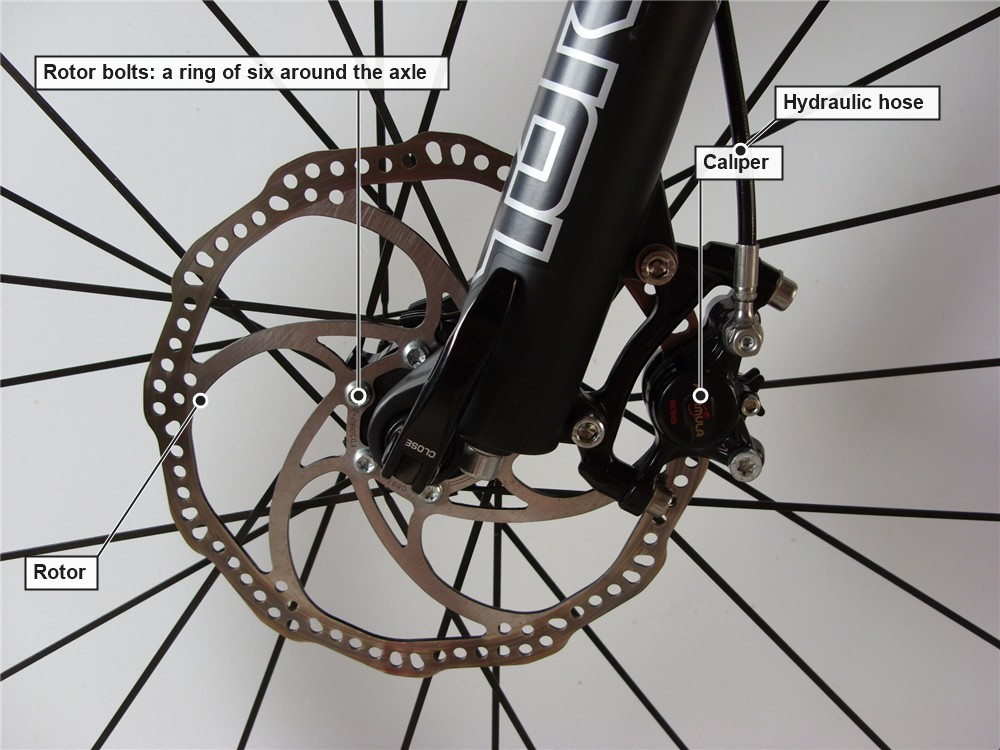
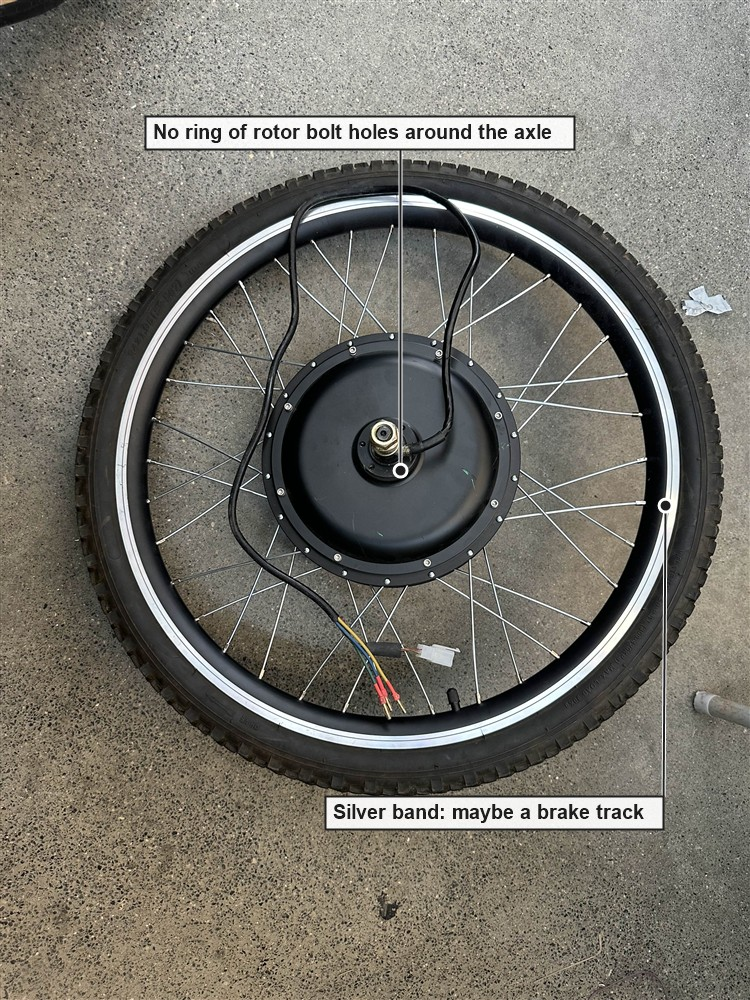
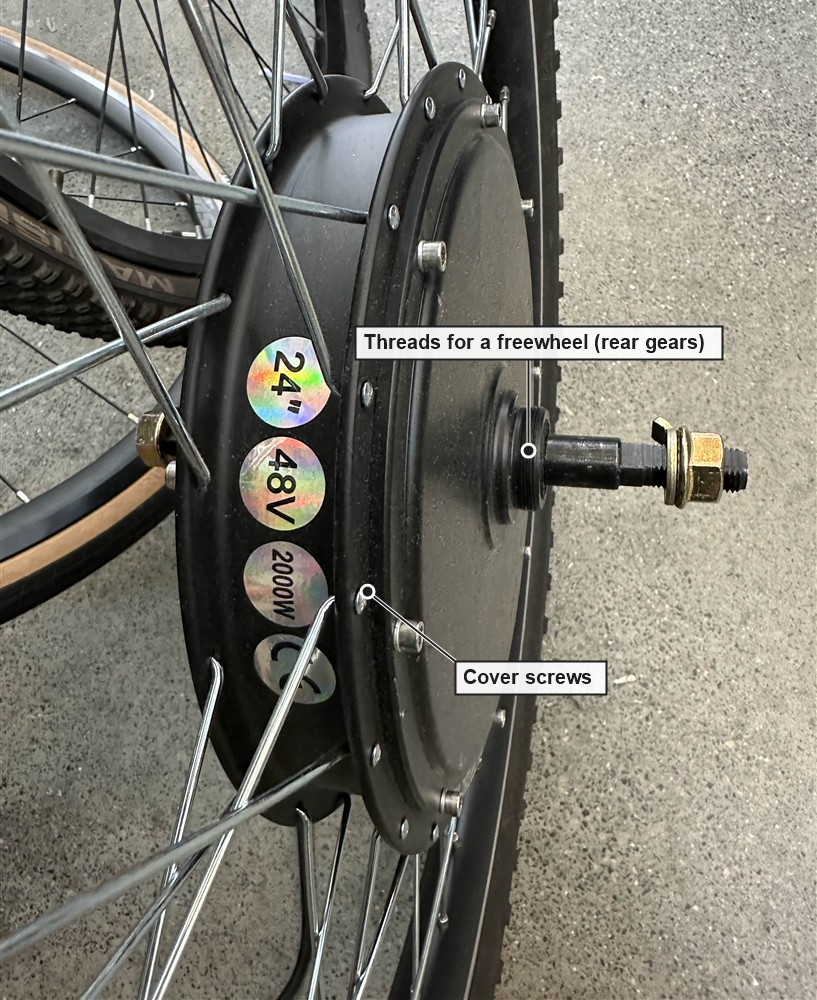
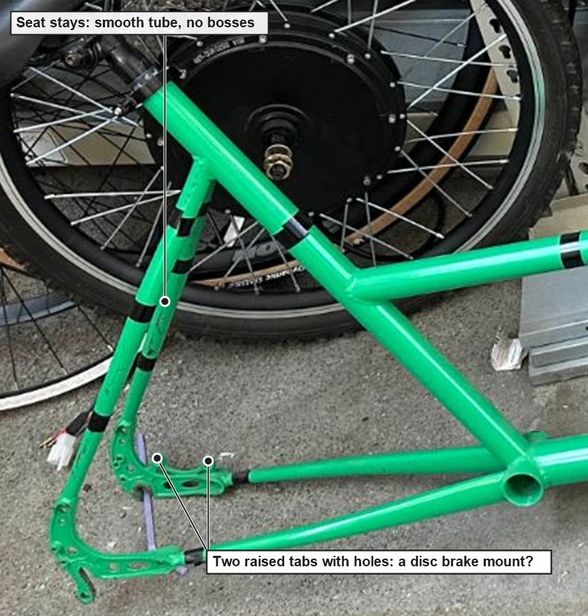
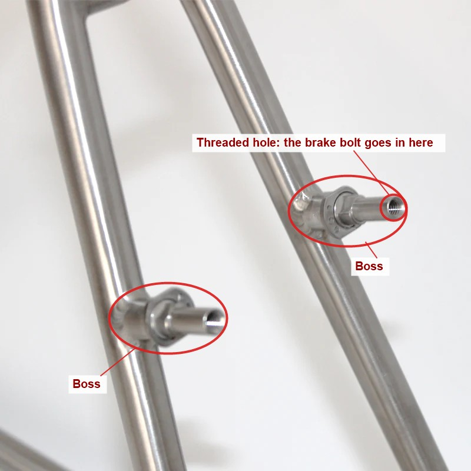
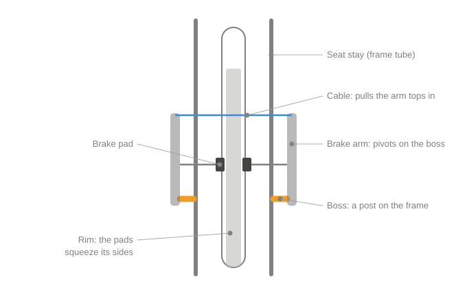
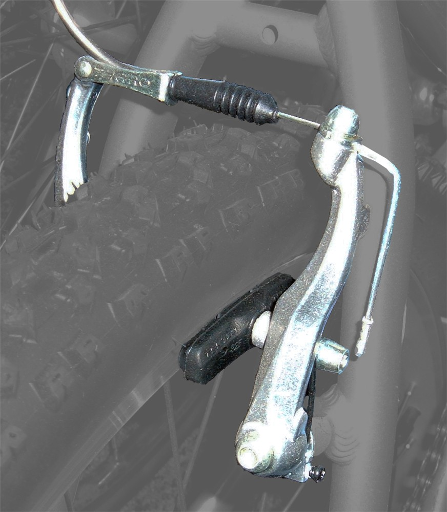
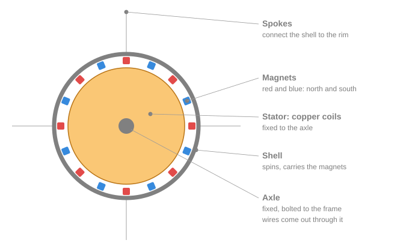

# Brakes on the Bakfiets

The bike needs a working brake on each wheel before anyone rides it. This page collects what's known so far, with photos of the bike, as a starting point for the brakes task ([#32](https://github.com/Electrium-Mobility/Bakfiets-F26/issues/32)).

## The short version

- The front wheel has a hydraulic disc brake with a hose too short to reach the handlebars. The handlebars sit in the middle of the bike and the front wheel is past the cargo box.
- The back wheel is the hub motor. It has no brake yet, and the motor and frame have no obvious place to mount one.
- Ontario law says pulling either brake lever has to stop the motor.

Our frame, with the parts this page talks about. Both wheels are still off the frame.

## Limits

- Each wheel needs its own brake, and together they have to stop the bike from 30 km/h within 9 m on level pavement ([ontario.ca](https://www.ontario.ca/page/riding-e-bike), [O. Reg. 369/09](https://www.ontario.ca/laws/regulation/090369) s. 5). The same regulation caps the bike's unladen weight at 120 kg.
- The motor has to stop pushing when a brake is applied (O. Reg. 369/09 s. 3(2)). A switch on each lever, wired to the controller's ADC2 input, is the usual way ([#18](https://github.com/Electrium-Mobility/Bakfiets-F26/issues/18), step 7).
- Steering and brakes share roughly $220 to $260 of the term's budget, so money spent on one comes out of the other.
- Changing the frame (welding, drilling, filing) needs approval from a mechanical lead and the project lead, because a bad weld or hole weakens a frame that carries cargo.
- Parts go through the project lead once the specs they need to match are posted, so orders stay inside the shared budget.
- Regen (the motor slowing the wheel) can't count as one of the two brakes. It stops working if the controller or battery cuts out, and fades away at low speed.

## Front wheel

The front brake is a hydraulic disc brake. The lever pushes fluid down a hose to a caliper, which grips a metal disc (the rotor) bolted to the hub.

What a disc brake looks like, on another bike. Ours is the same kind of brake.

Its hose is too short for this layout (seen in the bay). Its brand, model and fluid type decide which parts are compatible, so a close photo of the lever and caliper is the first thing to get.

The handlebars are far from the fork, so whatever steering design gets picked ([#25](https://github.com/Electrium-Mobility/Bakfiets-F26/issues/25)) links the two, and both ends turn. The brake line has to bend at both ends and still reach the caliper at the front axle. It could cross over the cargo box or follow the frame tubes under it (the two examples in the side view).

A long line also changes which kind of brake makes sense. A long cable gets more friction and feels mushier at the lever. A long hydraulic hose stays firm, but every part has to match the brake's fluid and it needs bleeding.

## Back wheel

### The motor has no disc mount

A disc rotor bolts to a ring of six holes around the axle, like in the disc brake photo above. Both sides of our motor are plain covers held on by small screws.

The motor is built for the back: its axle is wider than a front fork, and the threads next to it are for rear gears. So the back wheel has to be braked around the motor.

### The frame has no rim brake mounts

V-brakes and cantilever brakes mount on bosses: two short posts on the seat stays, just below the rim (the second photo, from another bike). Our seat stays are smooth tube with no bosses. An old style caliper rim brake needs a bridge between the stays to bolt through, so ours would need one added.

The rim has a silver band along its edge, which is usually a surface for rim brakes, if it's flat enough for the pads to grip.

One dropout plate has two raised tabs with holes in them. A disc caliper bolts to a pair of tabs like that, so they might be a disc brake mount (check 3 below covers how to tell).

### Approaches people use

For a rear hub motor with no disc mount:
- Bosses brazed or welded onto the seat stays, then a V-brake. Changes the frame.
- Clamp-on boss plates. Leaves the frame alone, but riders worry the clamps can slip under braking ([forum thread](https://cyclechat.net/threads/v-brakes-fitting-to-a-frame-without-bosses.26234)).
- An adapter that bolts a rotor to the motor's cover screws. Those screws are small and weren't made for braking loads, and it still needs a caliper mount on the frame.
- A disc tab, if the dropouts turn out to have one.
- A different motor with a disc mount.

Drum and coaster brakes need a hub built for them, which rules them out here. Braking on the motor shell itself would put heat right next to the magnets, which weaken when hot.

## Open questions

Check in the bay first:
1. The front brake's brand, model, fluid type and hose fittings. A longer hose, a new lever or a bleed kit all have to match these, and mixing mineral oil with DOT fluid ruins the seals.
2. The silver band on the rim, up close. A rim brake needs a flat metal surface to grip, so this decides whether rim brakes are an option for the back at all.
3. The two raised tabs on the dropout: the spacing between their holes and which side of the bike they're on. 51 mm apart is an IS disc mount and 74 mm is a post mount, and a rear disc tab only works on the left side. If it's a disc tab, a disc brake on the back becomes possible.

Then work out:
1. Reuse the front brake with a longer hose, or replace it? What would make each one the better choice?
2. Over the box or along the frame, and how long is the line then? The length decides what to buy, and the route has to survive the steering turning at both ends.
3. How will the back wheel be braked, what does it cost, and does it change the frame? Every rear option needs new mounts, an adapter or a different motor, so it could take a big share of the budget.
4. Which cut-off switch fits the levers you pick? It has to plug into the controller's ADC2 input. Some levers have one built in, others need a separate sensor.
5. What load should the brakes be sized for? A loaded cargo bike (rider, cargo, battery and a bike of up to 120 kg) is much heavier than a regular bike, and it still has to stop within 9 m from 30 km/h.

## What the brakes task should produce

Due Wed 21 Oct:
- a chosen front setup and a chosen rear setup, each with the reasons
- the parts and the specs they have to match (hose length and fittings, fluid type, levers with a cut-off switch)
- any frame change, flagged for approval
- how the brakes will be tested before anyone rides, for example a marked 9 m stopping distance with speed read off a phone's GPS

## Background

How a rim brake works on bosses

Each brake arm pivots on a boss. The cable pulls the tops of the arms together, so the pads squeeze the rim.

A real V-brake. The boss is hidden under the pivot bolt.

How the hub motor works

The axle and the stator (copper coils) are fixed to the frame and never turn. The shell, with magnets on its inside, spins around them and turns the wheel through the spokes. The controller sends current through the three phase wires in a rotating pattern, so the coils' magnetic field turns and drags the magnets along. This is also why braking on the shell is a bad idea: the magnets sit right under it and weaken when hot.

Words used here

- ADC2: the controller input the brake cut-off switch plugs into.
- Boss: a short post on the frame that a V-brake or cantilever arm pivots on.
- Bleed kit: tools and fluid for filling a hydraulic brake and pushing out air.
- Caliper: the part that squeezes. On a disc brake it grips the rotor.
- Dropouts: the plates at the back where the rear axle sits.
- Freewheel: the rear gears, which screw onto the hub.
- IS and post mount: the two common ways a disc caliper bolts to a frame or fork.
- Rotor: the metal disc on the hub that a disc caliper grips.
- Seat stays and chain stays: the pairs of tubes that run to the rear axle, from under the seat and from the pedals.

## Image credits

- Disc brake photo: [StromBer, Wikimedia Commons](https://commons.wikimedia.org/wiki/File:BrakeDiskVR.JPG), CC BY 3.0. Resized and labelled.
- V-brake photo: [Keithonearth, from a photo by ArnoldReinhold, Wikimedia Commons](https://commons.wikimedia.org/wiki/File:Linear_pull_bicycle_brake_highlighted.jpg), CC BY-SA 3.0. Resized and labelled.
- Bare bosses photo: [Bicycles Stack Exchange](https://bicycles.stackexchange.com/questions/87966/aside-from-brakes-what-items-can-be-mounted-to-v-brake-mounts), CC BY-SA. Resized and labelled.
- Frame and motor photos, labels and diagrams: Bakfiets F26.
