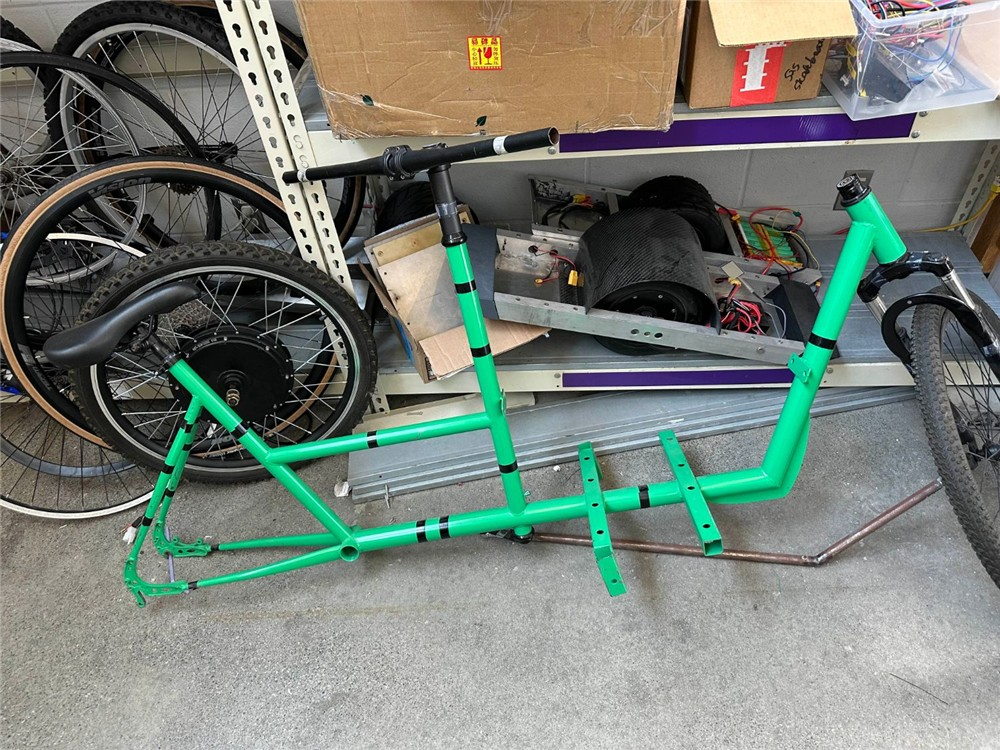
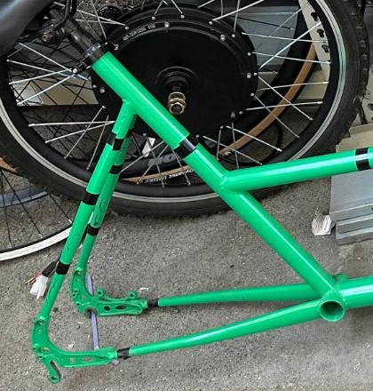
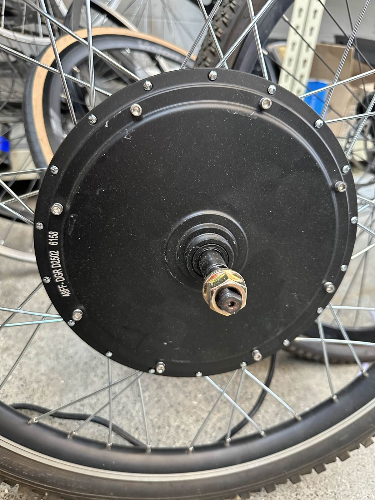

# Brakes: what we have and what we need

Background for [#32](https://github.com/Electrium-Mobility/Bakfiets-F26/issues/32). Written 10 Oct 2026.

## The problem

The bike has no working brakes yet. Ontario's e-bike rules need two independent braking systems that apply force to each wheel, able to stop the bike from 30 km/h within 9 m ([ontario.ca](https://www.ontario.ca/page/riding-e-bike)). Each brake lever also needs a motor cut-off.

- **Front wheel:** it already has a hydraulic disc brake, but its hose is too short. The handlebars sit behind the box and the front wheel is in front of it, so the hose needs about 2 to 2.5 m.
- **Back wheel:** this is the hub motor. It has nowhere to bolt a disc rotor, and the frame's seat stays have no bosses, so a rim brake has nothing to mount on either.

## Plan

Nothing gets bought until the specs below are posted on #32.

**Front brake.** Find parts that connect to the brake we already have:
1. Find the brand and model. It's usually printed on the lever or the caliper.
2. Find the fluid type. Mineral oil and DOT fluid can't be mixed, and the wrong one ruins the seals. It's usually printed on the lever's reservoir cap or the caliper.
3. Check the hose fittings at each end and the brake pad shape, so replacement parts match.
4. If the markings aren't clear, take the front brake apart (lever, hose and caliper) and measure it.
5. Measure the hose length needed with the steering in place ([#25](https://github.com/Electrium-Mobility/Bakfiets-F26/issues/25)), turned fully left and right.
6. Post the specs and the parts that match them: a longer hose, fittings, a bleed kit and fluid, or a new lever and caliper set if the old one can't be reused.

**Back brake.** Pick one of these and post it with photos:
1. Braze or weld bosses onto the seat stays, then fit a V-brake. The motor wheel's rim needs a flat metal braking edge for this, so check that first. This is a frame change, so it needs approval from a mechanical lead and the project lead.
2. A rotor adapter that bolts onto the motor's side cover, plus a disc tab on the frame. Only if a part exists that fits this motor.
3. A different rear motor that has a disc mount.

Regen braking can't be the rear brake. It stops working if the controller or battery cuts out.

## Parts of a bike

Seat stays run from under the seat down to the rear axle. Chain stays run forward from the rear axle to the pedals.

## What a boss is

A boss is a short metal post fixed to the frame, with a threaded hole in the end. Rim brakes need two, one on each seat stay just above the rim. The brake arms slide over them and a bolt holds each arm on.

Two bare bosses on a frame's seat stays, before a brake is fitted.

A V-brake mounted on bosses. The bosses are hidden under the bottom of each arm, where the bolt heads are.

## Where brake mounts sit

Bosses (orange) hold rim brakes. A disc tab holds a disc caliper, which needs a rotor on the wheel. A bridge hole holds an old style caliper brake.

## How a rim brake mounts on bosses

Seen from behind the rear wheel. The arms (grey) slide onto the bosses (orange). The cable (blue) pulls the arm tops together, and the pads (black) squeeze the rim.

## Our frame

The seat stays look smooth, with only tape on them, so there are no bosses. A close-up from directly behind would confirm it.

## How the hub motor works

The stator (copper coils) is fixed to the axle, and the axle is bolted to the frame, so it never turns. The shell has magnets glued inside it and spins around the stator. The spokes connect the shell to the rim. The controller switches current through the three phase wires one coil set at a time, each coil pulls the nearest magnet along, and the hall sensors tell it which coil to switch next.

Because the stator pushes back on the axle as hard as it pushes the wheel, the axle needs torque arms ([#31](https://github.com/Electrium-Mobility/Bakfiets-F26/issues/31)).

**Why brake pads can't press on the motor:** there's no mount on the frame beside the shell to hold a brake, the side covers are thin plates held on by small screws, the heat from braking would go straight into the motor's magnets, and the spoke flanges leave no flat surface for a pad.

Our motor's side cover. Stamp: 48FF-DGR D2502 6158. No brand or model was found online.

## Image credits

- Bike diagram: [Al2, Wikimedia Commons](https://commons.wikimedia.org/wiki/File:Bicycle_diagram-en.svg), CC BY 3.0. White background and viewBox added.
- V-brake photo: [Keithonearth, from a photo by ArnoldReinhold, Wikimedia Commons](https://commons.wikimedia.org/wiki/File:Linear_pull_bicycle_brake_highlighted.jpg), CC BY-SA 3.0. Resized.
- Bare bosses photo: [Bicycles Stack Exchange](https://bicycles.stackexchange.com/questions/87966/aside-from-brakes-what-items-can-be-mounted-to-v-brake-mounts), CC BY-SA. Resized.
- Frame and motor photos and the three diagrams: Bakfiets F26.
