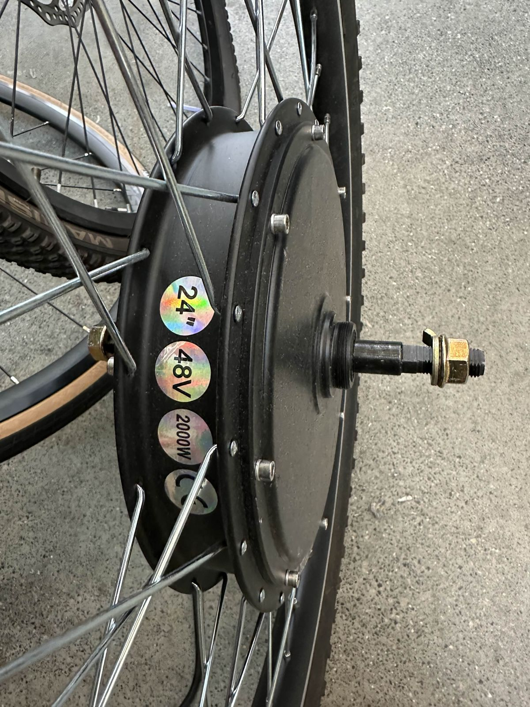
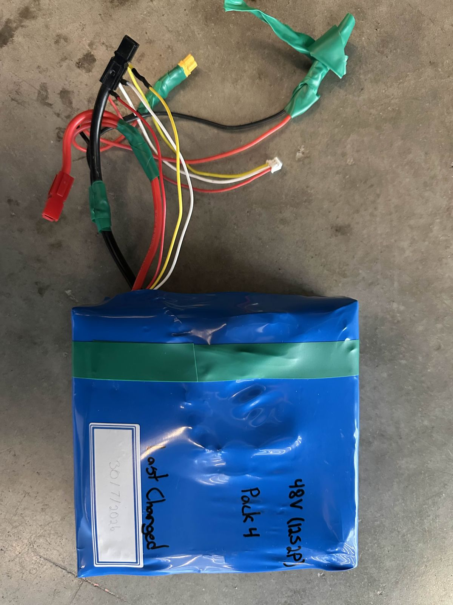

# What's in the bay (October 2026)

Photos taken in the Electrium bay in early October 2026. Look only: nobody plugs in, charges or opens a pack until it has been checked ([#21](https://github.com/Electrium-Mobility/Bakfiets-F26/issues/21)).

## Hub motor

The motor the bike uses: a direct-drive hub motor already built into a 24" wheel. The stickers say 24", 48 V and 2000 W. It has three thick phase wires with bullet plugs and a separate hall sensor plug.

| Photo | What it shows |
| --- | --- |
| [hub-motor-24in-48v-2000w-stickers.jpg](hub-motor-24in-48v-2000w-stickers.jpg) | The 24", 48 V, 2000 W stickers |
| [hub-motor-axle-label.jpg](hub-motor-axle-label.jpg) | The axle side, with the motor's printed code |
| [hub-motor-wheel.jpg](hub-motor-wheel.jpg) | The whole wheel |
| [hub-motor-phase-and-hall-plugs.jpg](hub-motor-phase-and-hall-plugs.jpg) | The three phase wires and the hall plug |
| [hub-motor-hall-plug.jpg](hub-motor-hall-plug.jpg) | The hall sensor plug up close |

## Motor controller and antispark

The controller has a USB-C port and three 100 V capacitors, which fits a VESC-style controller. No model label shows in these photos, so check the underside before powering it ([#18](https://github.com/Electrium-Mobility/Bakfiets-F26/issues/18)).

| Photo | What it shows |
| --- | --- |
| [motor-controller-heatsink.jpg](motor-controller-heatsink.jpg) | The controller from the heatsink side |
| [motor-controller-ports.jpg](motor-controller-ports.jpg) | The other side: USB-C and signal connectors |
| [antispark.jpg](antispark.jpg) | The antispark that goes between the battery and the controller |

## Battery packs

Four labelled packs. The bike uses **Pack 4**. The team also has a BMS and a charger.

| Photo | Label |
| --- | --- |
| [pack4-48v-12s2p-label.jpg](pack4-48v-12s2p-label.jpg) | **Pack 4: 48 V (12S2P)**, last charged 30 Jul 2026. The one we use |
| [pack3-36v-10s2p-label.jpg](pack3-36v-10s2p-label.jpg) | Pack 3: 36 V (10S2P) |
| [pack3-back.jpg](pack3-back.jpg) | Pack 3, other side |
| [pack3-connector-and-charge-cable.jpg](pack3-connector-and-charge-cable.jpg) | Pack 3's main plug and a charge cable |
| [pack2-36v-label.jpg](pack2-36v-label.jpg) | Pack 2: 36 V, last charged 30 Jul 2026 |
| [pack1-label-faded.jpg](pack1-label-faded.jpg) | Pack 1: label too faded to read, last charged 9 Sep 2026 |
| [pack1-leads.jpg](pack1-leads.jpg) | Pack 1's leads |

## Other

| Photo | What it shows |
| --- | --- |
| [esp32-s3-devkitc-1-box.jpg](esp32-s3-devkitc-1-box.jpg) | The ESP32 boards: Espressif ESP32-S3-DevKitC-1, the board the desk demo is written for |
| [esp32-s3-devkitc-1.jpg](esp32-s3-devkitc-1.jpg) | One of the boards out of its box |
| [spot-welder.jpg](spot-welder.jpg) | A portable spot welder (Kerpu), for building packs |

The full-size originals are kept by the project lead.
