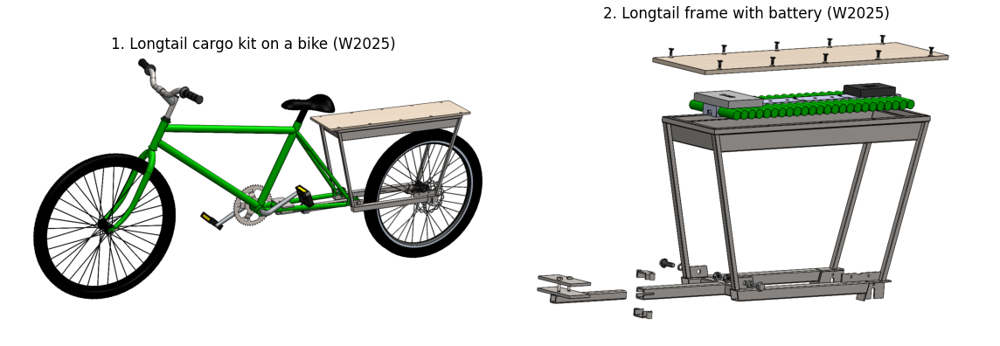

# Other Electrium projects worth copying from

Other Electrium teams have solved many of our problems already. This list comes from checking all 82 repos in the org in September 2026. Private repos need org access; post your GitHub username in the Discord thread.

## Hardware

| Resource | What you'll learn | Access |
| --- | --- | --- |
| [Longtail kit frame V7](https://github.com/Electrium-Mobility/longtail-conversion-kit/tree/main/Mechanical/LongtailFrameV7) | Another cargo frame, with PDF drawings, cutting templates, and printable 75° and 105° weld angle blocks | Public |
| [vroom battery box](https://github.com/Electrium-Mobility/vroom_mechanical/tree/main/Mechanical/Battery%20Box) | A battery box with BMS mount, bus bars and cut list; VESC and Daly BMS models next to it | Public |
| [Gokart mechanical](https://github.com/Electrium-Mobility/Gokart/tree/main/Mechanical) | A sheet-metal battery pack drawing with DXF, a printed button and screen housing, welding jigs | Public |
| [onewheel-w25](https://github.com/Electrium-Mobility/onewheel-w25) | Battery pack and BMS models, printable 18650 cell holders | Public |
| F24-Bike | A Bafang BBS02 model with bracket, and a saved paper with standard frame load cases | Private |
| S25Bike_CAD | Ready-made SolidWorks weldment profiles | Private |

## Electrical

See the table in [electrical/README.md](../electrical/README.md#boards-you-can-learn-from-or-reuse). Also:

| Resource | What you'll learn | Access |
| --- | --- | --- |
| [Longtail wiring diagram](https://github.com/Electrium-Mobility/longtail-conversion-kit/blob/main/Electrical/wiring%20diagram.drawio) | Battery to BMS to ESC to motor, plus a buck for the ESP32. Opens in [draw.io](https://app.diagrams.net/) | Public |
| [F25 Skateboard write-up](https://github.com/Electrium-Mobility/electrium-w24website/blob/main/docs/F2025-projects/F25%20Skateboard.md) | A finished project: 12S2P pack with BMS, two-stage buck power board, ESP32 reading the VESC and BMS | Public |
| eHPV power board (branch `schematic-updates`) | A PDB with fuse, surge protection, E-stop, buck and CAN transceiver | Private |

## Firmware

| Resource | What you'll learn | Watch out for |
| --- | --- | --- |
| [VESC6_LCD_EBIKE.ino](https://github.com/Electrium-Mobility/firmware-workshop/blob/main/VESC6_LCD_EBIKE/VESC6_LCD_EBIKE.ino) | Reads a VESC over UART and shows it on an SSD1306 OLED, like our display | No README; libraries ship as zip files (Sketch > Include Library > Add .ZIP) |
| [eskateboard-firmware](https://github.com/Electrium-Mobility/eskateboard-firmware/blob/main/src/main.cpp) | VESC UART data and a FastLED battery bar on ESP32 (PlatformIO) | Battery % is a fake test wave; its second serial port uses the USB pins |
| [F25 bike VESC dashboard](https://github.com/Electrium-Mobility/F25-Bike-Repository/tree/main/src/VescUartComunication) | A minimal VescUart dashboard | Battery % assumes 30 to 36 V; ours runs about 36 to 50.4 V |
| [Longtail VescCAN driver](https://github.com/Electrium-Mobility/longtail-conversion-kit/tree/main/Bike-Computer/Firmware/components/VescCAN) | An ESP-IDF driver that reads VESC status over CAN | **Its app file `src/vesc_comm.c` (lines 46 to 48) sends 5 A for 1 s at startup and would likely spin the motor. Delete those lines before testing** |
| [Gokart firmware](https://github.com/Electrium-Mobility/Gokart/tree/main/Firmware) | Working CAN (TWAI) send and receive, and an OLED menu with buttons | Not VESC code; buttons aren't debounced |
| [capyware-firmware](https://github.com/Electrium-Mobility/capyware-firmware) | Step-by-step ESP-IDF setup, and debounced buttons | Setup only |
| [Go-kart pin map](https://github.com/Electrium-Mobility/W26-Electrium-Gokart-ESP32S3/tree/main/src/gokart_lcd_esp32s3) | A clean one-file pin table (`hardware.h`) to copy for our own `pins.h` | |
