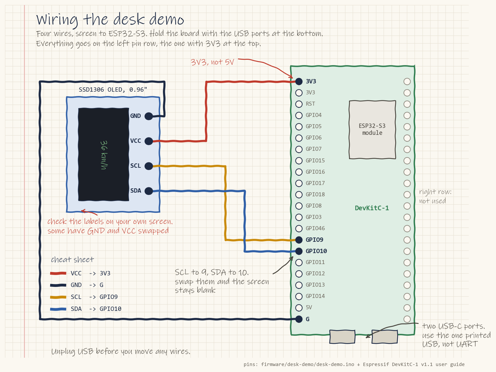

# Setup for firmware

Do [Getting Started](../../ONBOARDING.md#getting-started) in the onboarding guide first.

The steps you have to do are in [Firmware Stage 1](../../ONBOARDING.md#stage-1-run-the-desk-demo). This page repeats them with extra help, so you don't need to do anything twice.

## 1. What you need

- An **ESP32-S3 dev board**, such as the ESP32-S3-DevKitC-1. A plain ESP32 won't work: the code uses GPIO 9 and 10, which a plain ESP32 wires to its flash chip.
- An **SSD1306 128x64 I2C OLED** screen (the common 0.96-inch kind).
- Four female-to-female jumper wires and a USB-C data cable (charge-only cables don't work).
- No LED strip is needed for the desk demo.

Don't buy one. Electrium's ESP32 boards are on the black parts organizer in the bay. There are no screens yet, and the project lead is ordering some. Until then, run the board test in [Firmware Stage 1](../../ONBOARDING.md#stage-1-run-the-desk-demo), step 4. Do section 2 and steps 1 to 3 of section 3 on your own laptop in the meantime, then click **Verify** (the checkmark button) to check it builds without a board.

## 2. Install Arduino IDE and ESP32 support

1. Download [Arduino IDE 2](https://www.arduino.cc/en/software) and install it.
2. Add ESP32 boards with the written guide [Installing ESP32 in Arduino IDE 2](https://randomnerdtutorials.com/installing-esp32-arduino-ide-2-0/), or watch [Set up ESP32 with Arduino IDE in 3 minutes](https://www.youtube.com/watch?v=ikBlhX-erSw).
3. Choose **Tools > Manage Libraries**, and install **Adafruit SSD1306** and **FastLED**. When asked, click **Install all**, which also installs Adafruit GFX and Adafruit BusIO. The code needs FastLED to build even without an LED strip.

## 3. Run the desk demo

Steps 1 to 3 need no board. Click **Verify** (the checkmark, top left) after step 3 to check the code builds. The first build can take a few minutes, and it worked when the bottom panel says **Done compiling**.

1. In Arduino IDE, choose **File > Open** and pick `firmware\desk-demo\desk-demo.ino` in your clone (by default `Documents\GitHub\Bakfiets-F26\firmware\desk-demo\desk-demo.ino`).
2. Choose **Tools > Board > esp32 > ESP32S3 Dev Module**.
3. Set **Tools > USB CDC On Boot > Enabled** (set it to **Disabled** if you plug into the port labelled UART, or Serial Monitor stays blank).
4. Wire the screen: VCC to 3.3 V, GND to GND, SDA to GPIO 10, SCL to GPIO 9.

   

5. Plug the board in using the USB-C port labelled **USB** (not the one labelled UART). Choose its COM port under **Tools > Port**. Not sure which one? Unplug the board and look again: the one that disappears is yours.
6. Click **Upload**.
7. Wait about 10 seconds. The screen should show 50%, 36 km/h and PA 5. It's blank at first because the code plays the LED animation before it draws.

**Upload says "Failed to connect"?** Hold the **BOOT** button, tap **RST**, release BOOT, then click Upload again.
**No COM port?** Try another USB-C cable (some only charge), or, if you're on the port labelled UART, install the CP210x or CH340 USB driver.
**Blank screen?** Check the SDA and SCL wires, then, near the top of `desk-demo.ino`, change `#define SCREEN_ADDRESS 0x3C` to `0x3D` and upload again. The message "SSD1306 allocation failed" in Serial Monitor (**Tools > Serial Monitor**, speed set to 9600 at the bottom right) means the ESP32 couldn't reserve memory for the screen. It's not a wiring fault.

More help: [ESP32 OLED tutorial for beginners](https://www.youtube.com/watch?v=u8g34BS8Ouw) (17 min) and the written [ESP32 + SSD1306 guide](https://randomnerdtutorials.com/esp32-ssd1306-oled-display-arduino-ide/).

## 4. Learn the basics

| Topic | Link |
| --- | --- |
| Addressable LEDs with FastLED | [Get started with WS2812B and FastLED](https://www.youtube.com/watch?v=JEwKKacCE2k) (30 min) |
| Timing without freezing the code | [millis() instead of delay()](https://www.youtube.com/watch?v=BYKQ9rk0FEQ) (14 min) |
| CAN bus | [CAN bus explained](https://www.youtube.com/watch?v=FqLDpHsxvf8) (CSS Electronics, 9 min) and the written [ESP32 CAN guide](https://lastminuteengineers.com/esp32-can-bus-tutorial/) |
| VESC basics | [VESC Tool 2024 setup](https://www.youtube.com/watch?v=YFl3VvZTRb0) (MBoards, 23 min) |
| PlatformIO (used by other Electrium repos, optional) | [ESP32 in VS Code with PlatformIO](https://www.youtube.com/watch?v=F3oPVm2n-fk) (11 min) |

## 5. What exists

[`firmware/README.md`](../../firmware/README.md) lists the known bugs in the 2024 code and the other Electrium repos that already read a VESC.

## 6. Pick a first task

The desk demo (section 3) is your Stage 1. Post a photo on [#12](https://github.com/Electrium-Mobility/Bakfiets-F26/issues/12). Then pick a Stage 2 task in [ONBOARDING.md](../../ONBOARDING.md#firmware-onboarding).
