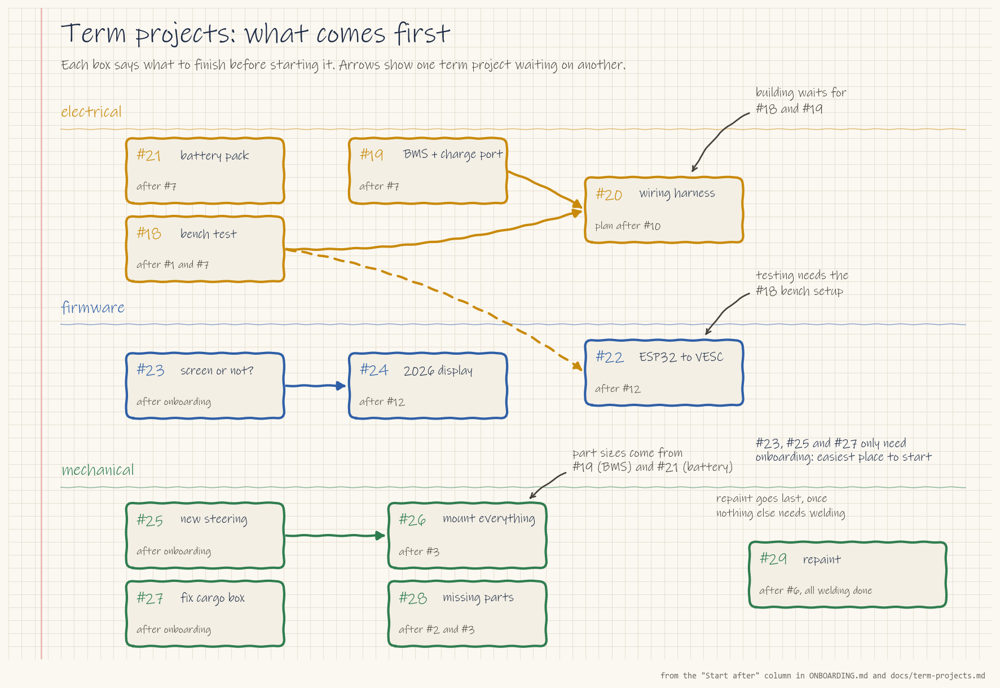

# Term projects (after onboarding)

These are the main goals for the term, from Ling, one of Electrium's two team leads (the other is Samantha Chong). Start them **after onboarding**: once you've finished your subteam's Stage 1 and one Stage 2 starter task from the [onboarding guide](../ONBOARDING.md).

Every project is a GitHub issue with the `term project` label. Each one lists what to finish first, step-by-step instructions, safety notes, links to videos and example code, and a clear "done when". Claim one with a comment on the issue saying you're working on it.

## Electrical

| Order | Project | Start after |
| --- | --- | --- |
| 1 | [#21 Battery pack: check and clear Pack 4](https://github.com/Electrium-Mobility/Bakfiets-F26/issues/21) | #7 |
| 2 | [#19 Choose a BMS and charging port](https://github.com/Electrium-Mobility/Bakfiets-F26/issues/19) | #7 |
| 3 | [#18 Bench test: battery, motor controller, motor and thumb throttle](https://github.com/Electrium-Mobility/Bakfiets-F26/issues/18) | #1 and #7 for the bench-supply steps. The pack steps also need #21 and #19 |
| 4 | [#20 Plan and build the wiring harness](https://github.com/Electrium-Mobility/Bakfiets-F26/issues/20) | #10, then #18 and #19 before building |

## Firmware

| Order | Project | Start after |
| --- | --- | --- |
| 1 | [#23 Decide: screen or no screen, and which one](https://github.com/Electrium-Mobility/Bakfiets-F26/issues/23) | #12 |
| 2 | [#22 Connect the ESP32-S3 to the VESC and show real speed and battery](https://github.com/Electrium-Mobility/Bakfiets-F26/issues/22) | #12. Testing needs #18 |
| 3 | [#24 Build the 2026 display on top of the 2024 work](https://github.com/Electrium-Mobility/Bakfiets-F26/issues/24) | #23, #12. Live data needs #22 |

## Mechanical

| Order | Project | Start after |
| --- | --- | --- |
| 1 | [#25 Design a new steering mechanism (rod, cable or hydraulic)](https://github.com/Electrium-Mobility/Bakfiets-F26/issues/25) | Onboarding. This is the top mechanical priority, and most of the parts budget goes to it |
| 2 | [#32 Choose and fit brakes, with levers that cut the motor](https://github.com/Electrium-Mobility/Bakfiets-F26/issues/32) | Onboarding. Nobody rides the bike without brakes |
| 3 | [#31 Fit the hub motor wheel to the frame, with torque arms](https://github.com/Electrium-Mobility/Bakfiets-F26/issues/31) | Onboarding. Nothing gets powered on the bike before this |
| 4 | [#6 Rerun the frame FEA with written load cases](https://github.com/Electrium-Mobility/Bakfiets-F26/issues/6) | #4, done with a mechanical lead. All cutting and welding waits for it |
| 5 | [#26 Mount everything on the frame](https://github.com/Electrium-Mobility/Bakfiets-F26/issues/26) | #3. Part sizes come from #19 and #21. Only mounts near the steering wait for #25 |
| 6 | [#27 Inspect and fix the cargo box](https://github.com/Electrium-Mobility/Bakfiets-F26/issues/27) | Onboarding |
| 7 | [#28 Find and buy missing bike parts](https://github.com/Electrium-Mobility/Bakfiets-F26/issues/28) | #2, #3 |
| 8 | [#30 Plan and finish the frame welds (work in progress)](https://github.com/Electrium-Mobility/Bakfiets-F26/issues/30) | #2, #4 and #6. Needs a welder who passed the SDC weld test |
| 9 | [#29 Repaint the frame](https://github.com/Electrium-Mobility/Bakfiets-F26/issues/29) | Last: after #30, once all welding is done and #6 is approved |

Decided (6 Oct): the bike uses the 48 V, 2000 W direct-drive hub motor in a 24" wheel and Pack 4 (48 V, 12S2P). Details are in [#1](https://github.com/Electrium-Mobility/Bakfiets-F26/issues/1) and [#21](https://github.com/Electrium-Mobility/Bakfiets-F26/issues/21).
