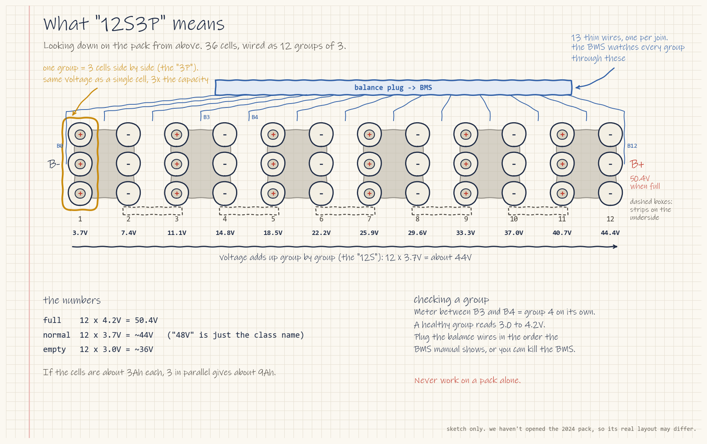
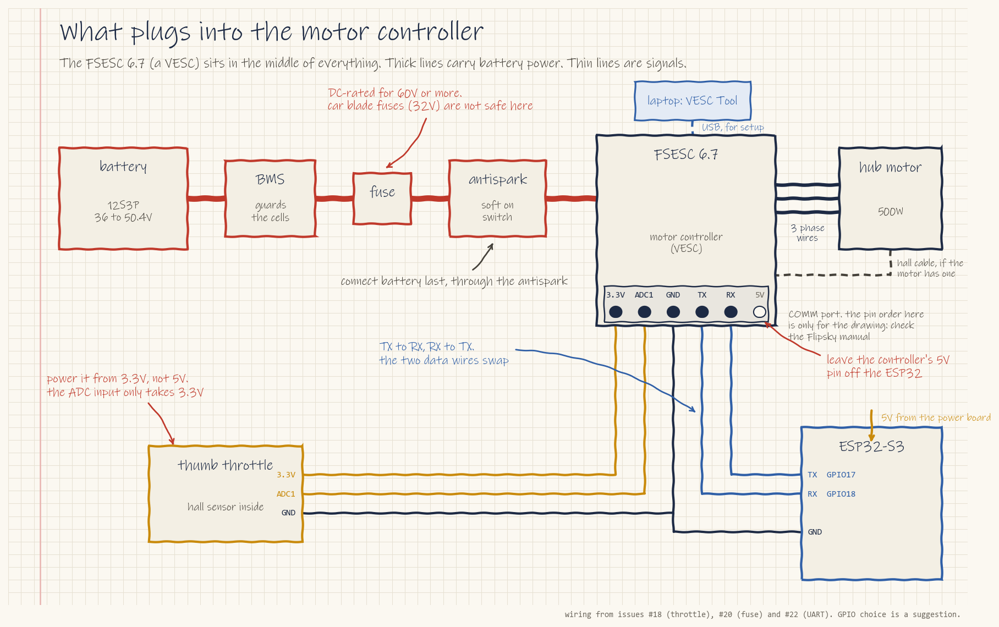

# Electrical

Setup steps are in [docs/setup/3-electrical.md](../docs/setup/3-electrical.md).

Only one electrical file survived from 2024: a block diagram, redrawn below. The 2024 schematics and pack notes were never pushed to GitHub. This term starts the electrical design fresh.

## The pack is "48 V"

The website says the 2024 pack was 12S3P of 18650 cells: 12 groups in series, each group being 3 cells in parallel, 36 cells in total. That's about 44 V nominal, 50.4 V full and about 36 V empty. "48 V" is the class name. **Every part that touches the battery must be rated well above 50.4 V.**

## How power flows through the bike

A redrawn, color-coded version of the 2024 block diagram. Red lines carry full battery voltage and orange lines carry 5 V. Dashed blue lines are signals only. The original is [`diagrams/high-level-circuit-diagram-2024.png`](diagrams/high-level-circuit-diagram-2024.png), and the script that draws this one is next to it.

Follow the numbers:

1. **Charger.** Fills the pack to 50.4 V.
2. **BMS.** Protects the cells from overcharge, over-discharge, overheating and shorts.
3. **Battery pack.** 12S3P of 18650 cells.
4. **Antispark.** The power button turns it on, so the controller's capacitors charge gently instead of sparking.
5. **Motor controller.** The ESC turns battery power into the three motor wires. The throttle sends it a speed request.
6. **Power board.** The PDB steps 48 V down to 5 V for the electronics and lights.
7. **ESP32-S3.** It drives the display over I2C and the LED strip, and reads the buttons. The brake lever switches the brake lights.

## What plugs into the motor controller

The throttle, UART and fuse details come from term projects #18, #20 and #22. The COMM port pin order in the drawing is only for layout; check the Flipsky manual.

## Boards you can learn from or reuse

| Board | Repo | Use it for |
| --- | --- | --- |
| Antispark switch (2023) | [anti-spark](https://github.com/Electrium-Mobility/anti-spark) | Your first schematic to read: 18 parts, three 100 V MOSFETs, gerbers included |
| Power distribution + antispark (2026) | [power-distribution-antispark](https://github.com/Electrium-Mobility/power-distribution-antispark) | Reference only, see below |
| ESC (2026) | [esc-w26](https://github.com/Electrium-Mobility/esc-w26) | A well-documented README with input protection explained. Built for 36 V |
| Small complete board | [raspberry-pi-breakout](https://github.com/Electrium-Mobility/raspberry-pi-breakout) | A tidy, recent KiCad project with reviewer notes |
| Lights and telemetry | [skateboards26-telemetrylights](https://github.com/Electrium-Mobility/skateboards26-telemetrylights) | Lights and a display fed by power-board signals |

**Can we use the 2026 power board as-is? No** (from reading its schematic; confirm with the datasheets). Its note says "Max Vin = 48V" and its MOSFETs are 60 V parts, which leaves little margin over a 50.4 V full pack. Its TVS diode (SMCJ48CA) has a 48 V standoff, so a full 50.4 V pack sits above its rating with little margin (breakdown starts at 53.3 V). It also clamps at 77.4 V, above what the 60 V MOSFETs survive. A new version needs 80 to 100 V MOSFETs and a TVS and buck converter rated to match.

*Photos 1 to 3 are from the F25 skateboard; 4 is the esc-w26 board. This is what finished electrical work looks like on this team.*

## Gaps

- Confirm the motor and controller on the real bike ([issue #1](https://github.com/Electrium-Mobility/Bakfiets-F26/issues/1))
- Schematic and PCB for the bakfiets power board
- Pack cells, BMS model and charge port
- Wiring harness, connector pinout and a BOM
