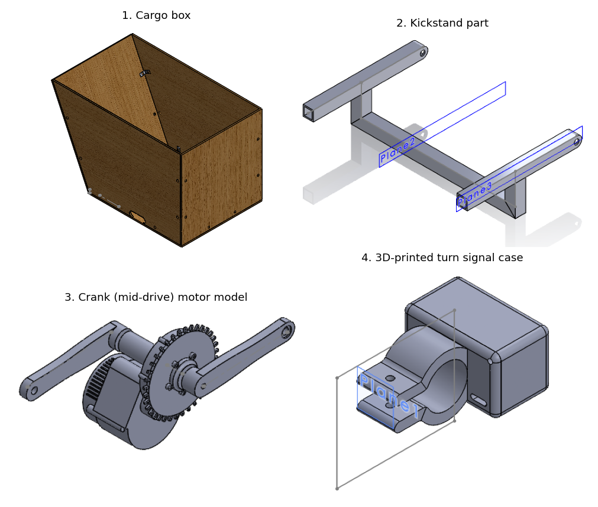

# Mechanical

All SolidWorks files for the bakfiets. Setup steps are in [docs/setup/2-mechanical.md](../docs/setup/2-mechanical.md).

**Don't move or rename files inside `cad-2024/` or `cad-2025-coop/`.** The assemblies find their parts by folder path. Put new work in `cad-2026/`, copying what you need with **File > Pack and Go** (add a prefix so names don't clash). One person edits a CAD file at a time: say on your issue which files you're changing, because Git can't merge two edits to the same SolidWorks file.

## Which model to use

| Folder | What it is | When to use it |
| --- | --- | --- |
| [`cad-2025-coop/`](cad-2025-coop/) | A clean rebuild from May 2025, on the `summer2025coop` branch (GitHub user Anthony3141). One master sketch drives the frame, suspension, steering rod, kickstand and a simple cargo box. Its commit says it models the partly built bike | Start here |
| [`cad-2024/`](cad-2024/) | The full 2024 design, exactly as the 2024 team left it | For parts the co-op model lacks: the jig, the notching guides, detailed steering and cargo box |
| [`cad-2025-coop/edited-2024-parts/`](cad-2025-coop/edited-2024-parts/) | Five 2024 parts the `summer2025coop` branch changed (kickstand, cargo box, aluminium angles) | Compare with the 2024 versions before using either |

## cad-2025-coop: the newest model

| File | What it is |
| --- | --- |
| `bakfiets_main_asm.SLDASM` | **Open this.** The whole bike |
| `bakfiets_master_sketch.SLDPRT` | The layout sketch every part follows |
| `bakfiets_frame.SLDPRT` | The frame (weldment) |
| `bakfiets_front_suspension.SLDPRT`, `bakfiets_front_wheel.SLDPRT` | Front end |
| `bakfiets_steering_handlebars.SLDPRT`, `bakfiets_steering_rod.SLDPRT`, `bakfiets_ball_joint.SLDPRT` | Steering linkage |
| `bakfiets_kickstand.SLDPRT` | Kickstand |
| `bakfiets_cargo_box_low_detail.SLDPRT` | Simple cargo box |
| `bakfiets_weldment_profiles/` | Tube profiles. Add the `cad-2025-coop` folder under SolidWorks File Locations > Weldment Profiles (see the setup guide) |

## cad-2024: the full 2024 design

| Part | Where | Notes |
| --- | --- | --- |
| Whole bike | `Assem1.SLDASM` | The 2024 top-level assembly |
| Frame | `Frame 2.0.SLDPRT`, drawing `Frame 2.0-Sweep8.SLDDRW` | Latest 2024 frame. Nobody recorded whether the drawing was used to build it |
| Tube sizes | `Weldment Cross-section/` | In the file names, as outside diameter x wall. Main tube 1.5" x 0.065", steering tube 36 x 1.1 mm, cargo tube 1" x 0.065", bottom bracket 38.1 x 3.3 mm, seat tube 28.6 x 0.6 mm, top tube 31.7 x 0.5 mm, head tube 1" x 0.065" or 46 x 1.5 mm. Unverified: a 1" head tube can't hold a standard headset, and 0.5 to 0.6 mm walls are donor-bike tubing, not something students can TIG weld. Confirm on the real frame in #4 |
| FEA | `Frame 2.0-Static 2.*` | One static study on Frame 2.0 (June 2024). The 95 MB results file was left out, so rerun the study to regenerate it. No record of the loads used |
| Welding jig | `jig/Jig/JigV2.SLDASM`, cut files `jig/Jig/*.dwg`, `*.DXF` | Laser-cut MDF jig for the main frame |
| Notching guides | `notches/*.STL` | 3D-print, slide over the tube, and cut to the line |
| Steering | `steering system/steeringAssembly.SLDASM` | Linkage, ball joint, steering plates |
| Kickstand | `KickstandAssembly.SLDASM`, `Kickstand.SLDPRT`, `KickstandBracketFeb15.SLDPRT` | |
| Cargo box | `Cargo Box/Cargo Box.SLDASM`, `Box and Frame.SLDASM`, `Box with angles.SLDASM` | Several versions, none marked final |
| Motor | `MotorCrank/CrankMotorAssembly.SLDASM` | A crank-mounted (mid-drive) motor model |
| Printed parts | `scrap bike parts/stem parts/turnSignalCase*.STL`, `battery box/battery pack/Antispark cover.SLDPRT` | Turn signal housing and antispark cover |
| Donor parts | `scrap bike parts/` | Fork, wheels, seat and stem modelled from scrap bikes |

*How the steering works: the handlebars turn a plate under the frame. A rod with a ball joint at each end carries that motion forward to a plate on the fork, so the front wheel turns.*

More previews of individual parts are in [`docs/images/cad-previews/`](../docs/images/cad-previews/).

## Gaps

- No record of the FEA loads or results
- No battery mount in any model
- Nobody has recorded how much of the real frame is welded

Don't send any drawing out for cutting or welding until the FEA loads and results are written down ([issue #6](https://github.com/Electrium-Mobility/Bakfiets-F26/issues/6)) and the mechanical lead and project lead have approved it.
